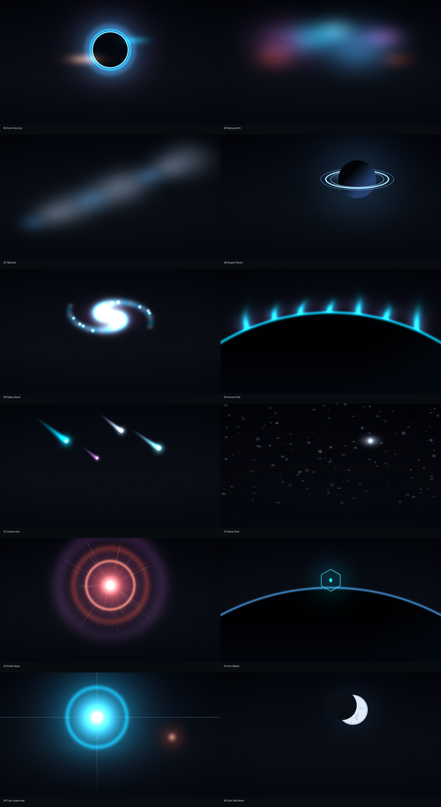
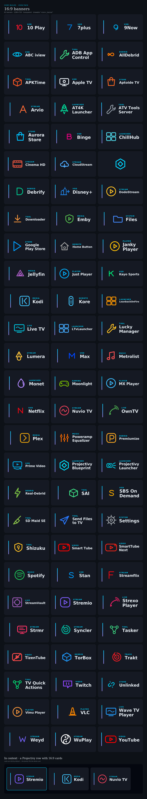

<div align="center">


# Core Builds Apps

**Five Android apps. One brand, one living-room bar.**

[](https://github.com/brevityA/CoreBuildsApps/actions/workflows/suite-ci.yml)
[](LICENSE)


</div>

---

<!-- suite-stamp:start -->
> | App | Current | What it does | Downloader | Release tag |
> |---|---:|---|---|---|
> | **[Core Builds Icon Pack](#-core-builds-icon-pack)** | `v1.9.5` | 961 transparent icons + 96 wallpapers for Projectivy Launcher | `5270601` | [`v*` / `iconpack`](../../releases) |
> | **[Core Line](#-core-line)** | `v1.3.0` | Sports scores & channel RSS ticker (chyron) | `7375676` | [`coreline-v*` / `coreline`](../../releases) |
> | **[Core Shift](#-core-shift)** | `v2.3.5` | Android TV screensaver + motion wallpaper browser | `8829421` | [`shift-v*` / `shift`](../../releases) |
> | **[Core Motion](#-core-motion)** | `v1.0.0` | Projectivy wallpaper-provider plugin for Core Motion loops | `[USER TO SUPPLY]` | [`motion-v*` / `motion`](../../releases) |
> | **[Core Doctor](#-core-doctor)** | `v0.1.0` | Local-only streaming and suite diagnostics (phone) | `8664938` | [`doctor-v*` / `doctor`](../../releases) |
>
> Each app has its own CI workflow and release tag. Do not merge Gradle roots, split the repo, or repoint floating Downloader tags.
<!-- suite-stamp:end -->

---

## 🔷 Core Builds Icon Pack

**Transparent app icons for Projectivy Launcher on Android TV.**

Designed for [Projectivy Launcher](https://play.google.com/store/apps/details?id=com.spocky.projengmenu) on Android TV and Google TV, built to the [Core Builds Brand & Style Guide v1.0](https://github.com/brevityA/Core-Builds). Every icon shares one visual language — original geometry, rounded-line brand motifs, one accent, transparent backgrounds — with the canonical **32px main stroke** and 26.2px / 21.8px detail. Brand artwork informs the recognisable cue and colour; it never replaces the pack's style with filled vendor silhouettes ([provenance and rights](THIRD_PARTY_NOTICES.md)).

> **Tip:** use a **dark card background** in Projectivy. These icons are drawn for night chrome (`#0d1117`).

> **Note:** mapped against Android TV / Google TV builds of each app. Mobile variants sometimes expose a different launcher activity — if an icon doesn't auto-assign, [open a prefilled issue](#request-an-icon) with the component name and it gets added.

### Install

1. Download with **Downloader code `5270601`**, or use the permanent APK URL:

   **https://github.com/brevityA/CoreBuildsApps/releases/download/iconpack/iconpack-release.apk**

   Versioned builds live under [**Releases**](../../releases) (`v*` tags). The `iconpack` release is a floating stable target — don't use the repo-wide `latest/download/…` URL, other apps release from this repo too.
2. Sideload it (Downloader, `adb install`, or a file manager).
3. Open the app and press **Apply** — it detects your launcher and hands off directly.

   Or manually: **Projectivy Settings → Appearance → Cards → Icon Pack → Core Builds Icon Pack**.

> **Android 11+:** the APK declares a `<queries>` block so launcher detection works under package-visibility filtering. No `QUERY_ALL_PACKAGES` needed.

> **Updates:** at launch the app checks `Latestrelease/version.json`. When a newer build exists, a **Download** button pulls the APK from GitHub and opens the system installer.

### What's covered

961 icons across streaming, media centres, debrid services, players, launchers, tools, stores, live TV, music, sport, gaming, VPN, browsers, files, and more — including [NoBuffr](https://downloads.nobuffr.com/android/nobuffr.apk), Stremio, Kodi, Jellyfin, Plex, Syncler, Real-Debrid, TorBox, VLC, SmartTube, Spotify, TiviMate, Downloader, plus Netflix, Disney+, Stan, Kayo, ABC iview and 900+ more.

Full table with every mapped component: [**docs/IconPackList.md**](docs/IconPackList.md)

<div align="center"></div>

### Wallpapers

96 curated wallpapers in seven series — browse in the Wallpapers tab, preview full-screen, **Set** as device wallpaper or **Save** to `Pictures/CoreBuilds`. Multi-select export bulk-saves to a folder any launcher can rotate from. Thumbnails ship in the APK; full images download on demand from GitHub.

All twelve Series 9 walls are also **live wallpapers**: each one's loop rides the same grid behind a LIVE badge, and **Set** hands you to the system live picker pre-pointed at Core Builds Live — a muted, looping `MediaPlayer` engine that pauses off-screen and shows the bundled frame until the clip has downloaded once. Motion loops stay out of bulk export (video has no place in the Pictures rotation folder); on Monet-as-HOME the action saves the MP4 to `Movies/CoreBuilds` instead, where Monet's own video picker finds it.

| Series | Walls | Theme |
|---|---|---|
| 1 · Fieldwork | 01–24 | Mesh gradients, aurora, light trails, topo |
| 2 · Motion | 25–32 | Long-exposure kinetics: orbitals, warp, spiral |
| 3 · Horizons | 33–40 | One horizon, eight meanings |
| 6 · Circuit Core | 12 | Lit-circuit fields on near-black |
| 7 · Retrowave | 12 | Gradient suns, perspective grids, chrome |
| 8 · AMOLED | 12 | Exact-black minimalism |
| 9 · Deep Space | 85–96 | Event horizon, nebulae, ringed planet, comets, novae |

<div align="center"></div>

Series 9's twelve walls have twelve moving companions — the same scene, animated, playable as the pack's own live wallpaper. The full map of what plays where (Core Motion plugin, Aerial Views, the in-pack engine): [Space live wallpapers](docs/SPACE_LIVE_WALLPAPERS.md). Everything about the collection (including the Monet **Send to Monet** handoff): [`Wallpapers/README.md`](Wallpapers/README.md).

### 16:9 banners

Every icon ships a **320×180 transparent banner** for Projectivy's wide-card layout — monoline glyph, cyan→violet rail, category, path-outlined name. Banners are what the pack applies by default; the in-app Art style toggle switches to square glyphs by pointing launchers at the small Core Builds Glyphs companion instead. Generated from `tools/build_banners.py`.

<div align="center"></div>

### The pack's own brand

Leanback banner, launcher icon, adaptive-icon masks — all generated from `tools/build_branding.py`, never hand-drawn.

<div align="center"></div>

<!-- issue-prefills:start -->
### Request an icon

Both issue forms are deep-linked: a report opens on the right template with
the right title and label already set — no chooser, no retyping the prefix.
Field values ride on the same URL. Only `input` and `textarea` fields accept
a prefill, so every required dropdown and confirm box is still answered by
the reporter — a link can never tick a gate for them.

| Open | Use it when | A link can prefill | Only in the form | Title / label |
|---|---|---|---|---|
| [🎨 New icon request](https://github.com/brevityA/CoreBuildsApps/issues/new?assignees=&labels=icon+request&projects=&template=1.new_icon_request.yml&title=%5BIcon%5D+) | Request an icon for an app that isn't in the pack yet. | App name\* · Component name · Store or download link\* · Anything else | Device type\* · Confirm | `[Icon]` · `icon request` |
| [🔧 Icon not auto-assigning](https://github.com/brevityA/CoreBuildsApps/issues/new?assignees=&labels=mapping&projects=&template=2.icon_not_applying.yml&title=%5BNot+applying%5D+) | The app is in the pack, but its icon doesn't appear on your device. | App name\* · The component name on YOUR device\* · Device and OS\* | Launcher\* · Confirm | `[Not applying]` · `mapping` |

One app per issue, and check [docs/IconPackList.md](docs/IconPackList.md) by
name, drawable and package first — a listed app that isn't applying belongs
on the other form.

For one specific app, let the generator build the link you paste into a reply:

```bash
python tools/build_issue_prefills.py --app Stremio \
    --template 2.icon_not_applying.yml \
    --component com.stremio.one/com.stremio.tv.MainActivity
```

```text
https://github.com/brevityA/CoreBuildsApps/issues/new?assignees=&labels=mapping&projects=&template=2.icon_not_applying.yml&title=%5BNot+applying%5D+Stremio&app_name=Stremio&component=com.stremio.one%2Fcom.stremio.tv.MainActivity
```

Generated from `.github/ISSUE_TEMPLATE/` by `tools/build_issue_prefills.py`.
Edit the forms, re-run the generator — `--check` fails this block on drift.
<!-- issue-prefills:end -->

---

### For developers

Everything generates from one file — `tools/catalog.json`. Never hand-edit XML.

```jsonc
{
  "name": "Example TV",
  "drawable": "example_tv",          // a-z0-9_ , unique
  "color": "#00D4FF",                // the app's accent
  "glyph": "play_round",             // from tools/glyphs.py
  "components": ["com.example.tv/.MainActivity"]
}
```

```bash
pip install -r tools/requirements.txt
python tools/build_icons.py      # SVGs, PNGs, appfilter, docs, preview
python tools/build_banners.py    # 16:9 monoline banners
python tools/build_branding.py   # launcher icon + TV banner
python tools/validate.py         # 26,000+ coherence checks
```

Find a component name with `adb shell dumpsys package <pkg> | grep -A1 "android.intent.action.MAIN"`. New shape? Add it to `tools/glyphs.py` on the 512 grid (stroke 34, safe area 432, rounded caps).

**Build the APK** (CI does this on every push; `v*` tags cut releases):

```bash
./gradlew assembleDebug     # unsigned, installable (needs JDK 17 + Android SDK)
./gradlew assembleRelease   # signed if keystore env vars are set
```

Design rules (enforced by generator + validator): transparent backgrounds · one accent per icon · 32px monoline · no solid fills or containers · 3:1 contrast on dark cards · banners share the common rail. Contributor guide: [AGENTS.md](AGENTS.md) · [CONTRIBUTING.md](CONTRIBUTING.md).

---

## 🔷 Core Line

**TV-first sports & channel ticker (chyron).** `v1.3.0`

A reader that crawls the listings your channel apps already publish as RSS — not a player, not streams:

```
LIVE  TOR 3-2 MTL  ·  TSN4  SN 3     ◆     LAL vs BOS  7:00 PM  ·  ESPN
```

One APK for phone, Shield, Google TV, Fire TV · messy listing lines parsed (`Team vs team epn, tsn4` → ESPN, TSN4) · ESPN/NHL/MLB scoreboards with a labeled demo fallback · same-Wi-Fi QR pairing so a Fire remote never types a URL · zero npm dependencies.

**Install:** Downloader code **`7375676`**, or the [**stable release**](../../releases/tag/coreline). Open it — a demo ticker loads immediately, then add feeds or pair from your phone.

Build: `cd ticker/android && ./gradlew :app:assembleDebug` · tests: `cd ticker && npm test` · [`ticker/HANDOVER.md`](ticker/HANDOVER.md)

---

## 🔷 Core Shift

**Android TV screensaver + motion wallpaper browser.** `v2.3.5`

Motion wallpapers on Android TV, three ways: browse + preview + download MP4 loops to `Movies/CoreBuilds` for **Monet Premium**'s video picker · the **Core Motion** plugin serves the feed to **Projectivy Premium** as `VIDEO` wallpapers · the **Aerial Views bridge** (`Motion/aerial-entries.json`) gives Monet an auto-updating feed plus a matching screensaver.

Content: 13 ffmpeg-procedural MP4 loops (1080p H.264), 3 self-authored GLSL shaders, bundled Lottie vectors — all §03 palette, HTTPS-only, works offline after first sync.

**Install:** Downloader code **`8829421`**, or **https://github.com/brevityA/CoreBuildsApps/releases/download/shift/coreshift-release.apk**

Build: `cd shift && ./gradlew :app:assembleDebug` · feed check: `python tools/validate_motion_feed.py` · [`shift/HANDOVER.md`](shift/HANDOVER.md)

---

## 🔷 Core Motion

**Projectivy wallpaper-provider plugin for Core Motion loops.** `v1.0.0`

The Projectivy-side delivery app: implements Spocky's `IWallpaperProviderService`, serves the GitHub-hosted feed plus bundled vector loops. Separate from Core Shift so the Monet/Aerial and Projectivy paths evolve independently.

**Install:** **https://github.com/brevityA/CoreBuildsApps/releases/download/motion/coremotion-release.apk** → Projectivy **Settings → Appearance → Wallpaper → Launcher wallpaper → Core Motion** (requires Projectivy Premium).

Build: `cd motion-plugin && ./gradlew :app:assembleDebug` · [`motion-plugin/README.md`](motion-plugin/README.md)

---

## 🔷 Core Doctor

**Streaming infrastructure diagnostics for your phone.** `v0.1.0`

Six checks on your setup's health — DNS, VPN detection, addon manifest + stream probe, Real-Debrid and TorBox account status. No backend, no persistence, no analytics; keys go only to their own provider; share reports are redacted by construction. Permissions: INTERNET, ACCESS_NETWORK_STATE, nothing else.

**Install:** Downloader code **`8664938`**, or [**Releases**](../../releases) under `doctor-v*` tags.

Build: `cd doctor && ./gradlew :app:assembleDebug` · [`doctor/SPEC.md`](doctor/SPEC.md)

---

## 🔷 Credits

Icon-pack conventions follow [Projectivy Icon Pack](https://github.com/SicMundus86/ProjectivyIconPack) by SicMundus86. Projectivy Launcher is by Spocky. App names and trademarks belong to their owners ([sources and notices](THIRD_PARTY_NOTICES.md)) — no endorsement implied.

*Retired September 2026: Core Builds Pixel Neon and Core Builds Pop. The suite keeps one icon pack; their last releases stay under their tags in [Releases](../../releases).*

Part of the [Core Builds](https://github.com/brevityA/Core-Builds) ecosystem · [ko-fi.com/branding_brevity](https://ko-fi.com/branding_brevity)
