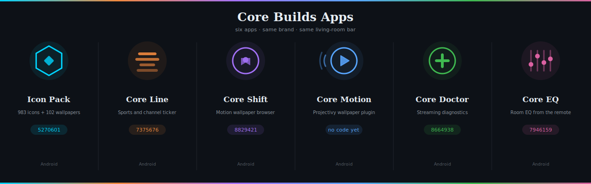

# Core Builds Apps

**Six Android apps. One brand, one living-room bar.**

Five apps for Android TV and Google TV, and one for your phone. Each installs from a Downloader code, and the table shows every app's current release. Every app has a short card on this page and a full guide in [`docs/apps/`](docs/apps/). Community: **[Discord](https://discord.gg/AwJ49yzbqT)** · **[r/CoreBuilds](https://www.reddit.com/r/CoreBuilds/)**. Every app is free; if one earns a place on your TV, you can support it on **[Ko-fi](https://ko-fi.com/branding_brevity)**.

---

<!-- suite-stamp:start -->
> | App | Current | What it does | Downloader | Release tag |
> |---|---:|---|---|---|
> | **[Core Builds Icon Pack](#-core-builds-icon-pack)** | `v2.2.0` | 983 transparent icons + 102 wallpapers for Projectivy Launcher | `5270601` | [`v*` / `iconpack`](../../releases) |
> | **[Core Line](#-core-line)** | `v1.4.4` | Sports scores & channel RSS ticker (chyron) | `7375676` | [`coreline-v*` / `coreline`](../../releases) |
> | **[Core Shift](#-core-shift)** | `v2.3.5` | Android TV screensaver + motion wallpaper browser | `8829421` | [`shift-v*` / `shift`](../../releases) |
> | **[Core Motion](#-core-motion)** | `v1.0.0` | Projectivy wallpaper-provider plugin for Core Motion loops | none yet | [`motion-v*` / `motion`](../../releases) |
> | **[Core Doctor](#-core-doctor)** | `v0.1.0` | Local-only streaming and suite diagnostics (phone) | `8664938` | [`doctor-v*` / `doctor`](../../releases) |
> | **[Core EQ](#-core-eq)** | `v1.3.2` | Room EQ measured per TV audio output, with manual/content-mode tone controls | `7946159` | [`coreeq-v*` / `coreeq`](../../releases) |
>
> The Icon Pack release also carries a glyphs-only pack — square art, no banners (`tv.corebuilds.iconpack.glyphs`) — Downloader `5804177`.
<!-- suite-stamp:end -->

---

## Install any app

1. On the TV, install **Downloader** by AFTVnews from the Play Store or Amazon Appstore.
2. Enter the app's **Downloader code** from the table above, and install the APK when Android asks.
3. Open the app.

Each card below also has a **permanent APK link**. It always serves the current release from that app's own floating tag, such as `iconpack` or `coreeq`. Don't use the repo-wide `releases/latest/download/…` URL: six apps release from this repo, so "latest" is whichever one shipped last.

Icon Pack, Core Line, Core Shift and Core EQ check for their own updates. Core Motion and Core Doctor update by installing the new APK over the old one.

---

## 🔷 Core Builds Icon Pack

**Transparent icons and 16:9 banners for Projectivy Launcher, plus wallpapers.** Every icon is drawn in one style: original geometry, one accent colour, transparent background. The pack applies banners by default; a square glyph build is one switch away. Home's **Missing icons** row lists the apps on your TV that have no icon yet and prefills the request for you.

**Install:** Downloader **`5270601`** · [permanent APK](https://github.com/brevityA/CoreBuildsApps/releases/download/iconpack/iconpack-release.apk) · then press **Apply** in the app. \
**More:** [guide](docs/apps/icon-pack.md) · [every mapped app](docs/IconPackList.md) · [wallpapers](Wallpapers/README.md) · [changelog](CHANGELOG.md)

## 🔷 Core Line

**A TV-first sports and channel ticker.** It crawls the listings your channel apps already publish as RSS, with live ESPN, NHL and MLB scores. It is not a player and carries no streams. Pair it from your phone with a QR code, so a Fire TV remote never types a URL.

**Install:** Downloader **`7375676`** · [permanent APK](https://github.com/brevityA/CoreBuildsApps/releases/download/coreline/coreline-release.apk) \
**More:** [guide](docs/apps/core-line.md) · [changelog](ticker/CHANGELOG.md)

## 🔷 Core Shift

**An Android TV screensaver and motion wallpaper browser.** Browse, preview and download MP4 loops for Monet's video picker, or feed them to Projectivy through Core Motion and to Aerial Views as a screensaver. Works offline after the first sync.

**Install:** Downloader **`8829421`** · [permanent APK](https://github.com/brevityA/CoreBuildsApps/releases/download/shift/coreshift-release.apk) \
**More:** [guide](docs/apps/core-shift.md)

## 🔷 Core Motion

**The Projectivy wallpaper plugin for Core Motion loops.** It serves the motion feed and bundled loops to Projectivy Premium as launcher wallpapers.

**Install:** no Downloader code yet · [permanent APK](https://github.com/brevityA/CoreBuildsApps/releases/download/motion/coremotion-release.apk) · then pick **Core Motion** in Projectivy's wallpaper settings. \
**More:** [guide](docs/apps/core-motion.md)

## 🔷 Core Doctor

**Streaming diagnostics for your phone.** Six checks: DNS, VPN detection, addon manifest and stream probe, and Real-Debrid and TorBox account status. No backend, nothing stored, no analytics, and shared reports are redacted.

**Install:** Downloader **`8664938`** · [permanent APK](https://github.com/brevityA/CoreBuildsApps/releases/download/doctor/coredoctor-release.apk) \
**More:** [guide](docs/apps/core-doctor.md)

## 🔷 Core EQ

**Measure the room you sit in, with the remote you already hold.** A sweep through the remote's microphone builds a room correction for each TV output, with Movie / TV, Everyday and Gaming tone modes on top. Each sweep gets a 0–100 recording score. Android 11 and later.

**Install:** Downloader **`7946159`** · [permanent APK](https://github.com/brevityA/CoreBuildsApps/releases/download/coreeq/coreeq-release.apk) \
**More:** [guide](docs/apps/core-eq.md) · [changelog](coreeq/CHANGELOG.md)

---

## Get help

The issue forms here are for icons: request one for an app the pack doesn't draw yet, or report one that isn't applying. Each link below opens with the right template, title and label already set. For anything else, ask on the [Core Builds Discord](https://discord.gg/AwJ49yzbqT) or [r/CoreBuilds](https://www.reddit.com/r/CoreBuilds/), and name the app, its version and your device.

<!-- issue-prefills:start -->
<!-- Generated from .github/ISSUE_TEMPLATE/ by tools/build_issue_prefills.py. Edit the forms and re-run it; --check fails this block on drift. -->
### Request an icon

Both issue forms are deep-linked: a report opens on the right template with
the right title and label already set — no chooser, no retyping the prefix.
Field values ride on the same URL. Only `input` and `textarea` fields accept
a prefill, so every required dropdown and confirm box is still answered by
the reporter — a link can never tick a gate for them.

| Open | Use it when | A link can prefill | Only in the form | Title / label |
|---|---|---|---|---|
| [🎨 New icon request](https://github.com/brevityA/CoreBuildsApps/issues/new?assignees=&labels=icon+request&projects=&template=1.new_icon_request.yml&title=%5BIcon%5D+) | Request an icon for an app that isn't in the pack yet. | App name\* · Component name · Store or download link\* · Anything else | Device type\* · Confirm | `[Icon]` · `icon request` |
| [🔧 Icon not auto-assigning](https://github.com/brevityA/CoreBuildsApps/issues/new?assignees=&labels=mapping&projects=&template=2.icon_not_applying.yml&title=%5BNot+applying%5D+) | The app is in the pack, but its icon doesn't appear on your device. | App name\* · The component name on YOUR device\* · Device and OS\* | Launcher\* · Confirm | `[Not applying]` · `mapping` |

One app per issue, and check [docs/IconPackList.md](docs/IconPackList.md) by
name, drawable and package first — a listed app that isn't applying belongs
on the other form. On the TV, the Icon Pack's **Missing icons** row builds
the same links for the apps it finds and shows them as a QR code.
<!-- issue-prefills:end -->

---

## For developers

Each app is its own Gradle root with its own CI workflow and release tag. Don't merge the roots or repoint the floating tags.

| App | Source | Build | Notes |
|---|---|---|---|
| Icon Pack | `app/` | `./gradlew assembleDebug` | Everything generates from `tools/catalog.json`; see the [guide](docs/apps/icon-pack.md#for-developers) |
| Core Line | `ticker/` | `cd ticker/android && ./gradlew :app:assembleDebug` | Tests: `cd ticker && npm test` |
| Core Shift | `shift/` | `cd shift && ./gradlew :app:assembleDebug` | Feed check: `python tools/validate_motion_feed.py` |
| Core Motion | `motion-plugin/` | `cd motion-plugin && ./gradlew :app:assembleDebug` | |
| Core Doctor | `doctor/` | `cd doctor && ./gradlew :app:assembleDebug` | |
| Core EQ | `coreeq/` | `cd coreeq && ./gradlew :app:assembleDebug` | DSP reference: `tools/core_eq_dsp.py` |

The table at the top is generated from `suite.json` by `tools/build_readme_badge.py`, and `tools/check_suite_truth.py` fails CI when it drifts. Contributor guide: [AGENTS.md](AGENTS.md) · [CONTRIBUTING.md](CONTRIBUTING.md) · [publishing](PUBLISHING.md).

---

## Credits

Icon-pack conventions follow [Projectivy Icon Pack](https://github.com/SicMundus86/ProjectivyIconPack) by SicMundus86. Projectivy Launcher is by Spocky. App names and trademarks belong to their owners ([sources and notices](THIRD_PARTY_NOTICES.md)) — no endorsement implied.

*Retired September 2026: Core Builds Pixel Neon and Core Builds Pop. The suite keeps one icon pack; their last releases stay under their tags in [Releases](../../releases).*

Part of the [Core Builds](https://github.com/brevityA/Core-Builds) ecosystem · [Discord](https://discord.gg/AwJ49yzbqT) · [r/CoreBuilds](https://www.reddit.com/r/CoreBuilds/) · [Ko-fi](https://ko-fi.com/branding_brevity)
