
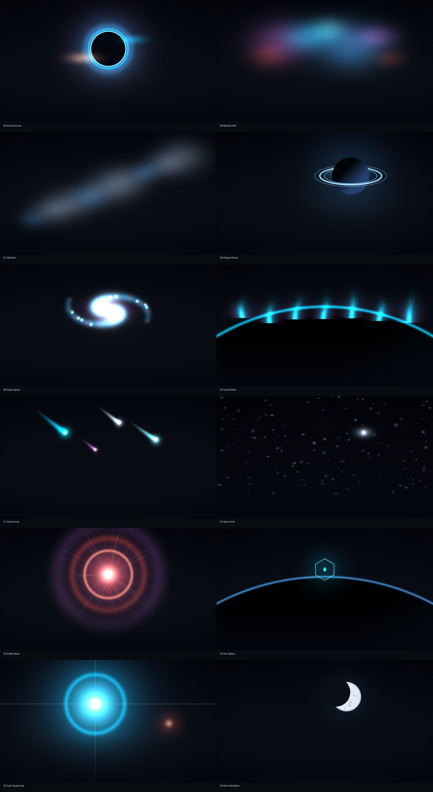
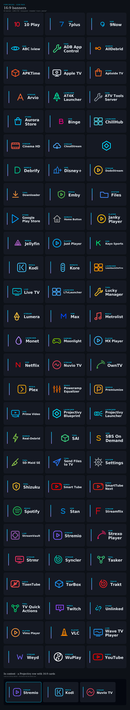
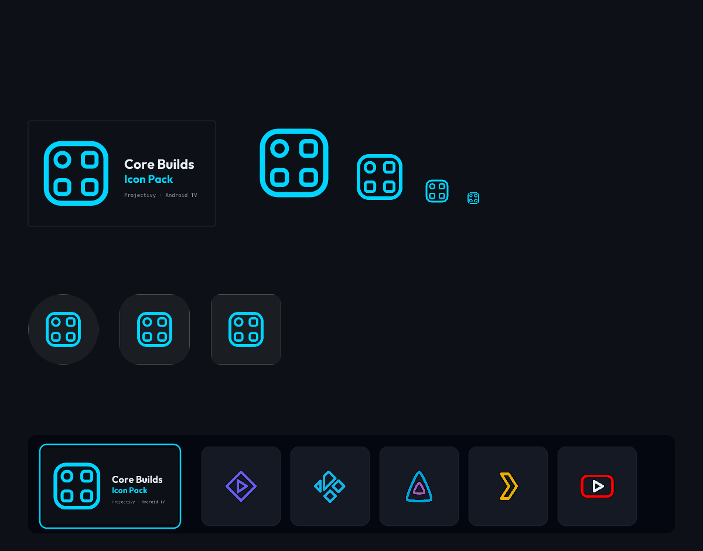

# Core Builds Icon Pack

**Transparent app icons for Projectivy Launcher on Android TV.** Back to the [suite page](../../README.md).

Designed for [Projectivy Launcher](https://play.google.com/store/apps/details?id=com.spocky.projengmenu) on Android TV and Google TV, built to the [Core Builds Brand & Style Guide v1.0](https://github.com/brevityA/Core-Builds). Every icon shares one visual language — original geometry, rounded-line brand motifs, one accent, transparent backgrounds — with the canonical **32px main stroke** and 26.2px / 21.8px detail. Brand artwork informs the recognisable cue and colour; it never replaces the pack's style with filled vendor silhouettes ([provenance and rights](../../THIRD_PARTY_NOTICES.md)).

> **Tip:** use a **dark card background** in Projectivy. These icons are drawn for night chrome (`#0d1117`).

> **Note:** mapped against Android TV / Google TV builds of each app. Mobile variants sometimes expose a different launcher activity — if an icon doesn't auto-assign, [open a prefilled issue](../../README.md#request-an-icon) with the component name and it gets added.

## Install

1. Download with **Downloader code `5270601`**, or use the permanent APK URL:

   **https://github.com/brevityA/CoreBuildsApps/releases/download/iconpack/iconpack-release.apk**

   Versioned builds live under [**Releases**](https://github.com/brevityA/CoreBuildsApps/releases) (`v*` tags). The `iconpack` release is a floating stable target — don't use the repo-wide `latest/download/…` URL, other apps release from this repo too.
2. Sideload it (Downloader, `adb install`, or a file manager).
3. Open the app and press **Apply** — it detects your launcher and hands off directly.

   Or manually: **Projectivy Settings → Appearance → Cards → Icon Pack → Core Builds Icon Pack**.

> **Android 11+:** the APK declares a `<queries>` block so launcher detection works under package-visibility filtering. No `QUERY_ALL_PACKAGES` needed.

> **Updates:** at launch the app checks `Latestrelease/version.json`. When a newer build exists, a **Download** button pulls the APK from GitHub and opens the system installer.

### Glyphs-only builds

Prefer square glyphs and no banners? The pack's `v*` release carries two builds for that, both at the pack's version:

- **Core Builds Glyphs Pack** (`tv.corebuilds.iconpack.glyphs`) — the resource-only square twin the Art style toggle installs: the same icons mapped to the same components, square, no banners, plus one info screen. **Downloader code `5804177`** · **https://github.com/brevityA/CoreBuildsApps/releases/download/iconpack/iconpack-glyphs-release.apk**
- **Core Builds Glyphs** (`tv.corebuilds.glyphs`) — the whole app (catalog, wallpapers, settings, auditor) built with the square appfilter and no Art style toggle, for a launcher that should never apply banners. No Downloader code yet — install it from **https://github.com/brevityA/CoreBuildsApps/releases/download/iconpack/corebuilds-glyphs-release.apk**

Both install beside the icon pack (their own package IDs and FileProvider authorities), and a launcher applies whichever one you point it at. The standalone app ships no update feed of its own yet, and **Settings → Updates** names that rather than offering the banner APK it couldn't install over itself.

## Missing an icon?

Home's **Missing icons** row scans the apps on your TV and shows how many have no Core Builds icon. The scan sorts them in two groups. **Icon not applying** means the pack draws the app under another activity, usually one an app update renamed, so the row files a mapping report. **No icon** means the pack does not draw it yet, so the row files an icon request. Each request carries a QR code you scan with your phone. The links and forms are on the [suite page](../../README.md#request-an-icon).

## What's covered

Icons across streaming, media centres, debrid services, players, launchers, tools, stores, live TV, music, sport, gaming, VPN, browsers, files, and more — including [NoBuffr](https://downloads.nobuffr.com/android/nobuffr.apk), Stremio, Kodi, Jellyfin, Plex, Syncler, Real-Debrid, TorBox, VLC, SmartTube, Spotify, TiviMate, Downloader, plus Netflix, Disney+, Stan, Kayo, ABC iview and 900+ more. The current count is in the [suite table](../../README.md).

Full table with every mapped component: [**docs/IconPackList.md**](../IconPackList.md)

<div align="center"></div>

## Wallpapers

102 curated wallpapers in eight series — browse in the Wallpapers tab, preview full-screen, **Set** as device wallpaper or **Save** to `Pictures/CoreBuilds`. Multi-select export bulk-saves to a folder any launcher can rotate from. Thumbnails ship in the APK; full images download on demand from GitHub.

All twelve Series 9 walls and all six Series 10 walls are also **live wallpapers**: each one's loop rides the same grid behind a LIVE badge, and **Set** hands you to the system live picker pre-pointed at Core Builds Live — a muted, looping `MediaPlayer` engine that pauses off-screen and shows the bundled frame until the clip has downloaded once. Loops sit under their own **Live** chip and bulk-export alongside stills: loops save as MP4 to `Movies/CoreBuilds`, where video-wallpaper pickers such as Monet's find them, and stills to `Pictures/CoreBuilds` for launcher rotation. On Monet-as-HOME, **Set** saves the MP4 to `Movies/CoreBuilds` instead.

| Series | Walls | Theme |
|---|---|---|
| 1 · Fieldwork | 01–24 | Mesh gradients, aurora, light trails, topo |
| 2 · Motion | 25–32, 51–54 | Long-exposure kinetics: orbitals, warp, spiral |
| 3 · Horizons | 33–40, 55–58 | One horizon, eight meanings |
| 6 · Circuit Core | 41–50, 79–80 | Lit-circuit fields on near-black |
| 7 · Retrowave | 59–68, 81–82 | Gradient suns, perspective grids, chrome |
| 8 · AMOLED | 69–78, 83–84 | Exact-black minimalism |
| 9 · Deep Space | 85–96 | Event horizon, nebulae, ringed planet, comets, novae |
| 10 · Cinema | 97–102 | Neon cinema nights: marquee, velvet curtain, projector beam, lounge, late rentals, box office |

Series numbers are historical — 4 and 5 both retired with earlier packs. The [series map](../../Wallpapers/README.md) has the full numbering.

<div align="center"></div>

Series 9's twelve walls have twelve moving companions — the same scene, animated, playable as the pack's own live wallpaper. The full map of what plays where (Core Motion plugin, Aerial Views, the in-pack engine): [Space live wallpapers](../SPACE_LIVE_WALLPAPERS.md). Everything about the collection (including the Monet **Send to Monet** handoff): [`Wallpapers/README.md`](../../Wallpapers/README.md).

## 16:9 banners

Every icon ships a **320×180 transparent banner** for Projectivy's wide-card layout — monoline glyph, icon-coloured category, stroke-letter name, nothing else on the card. Banners are what the pack applies by default; the in-app Art style toggle switches to square glyphs by pointing launchers at the small Core Builds Glyphs Pack companion instead (`tv.corebuilds.iconpack.glyphs`, Downloader `5804177`, [permanent URL](https://github.com/brevityA/CoreBuildsApps/releases/download/iconpack/iconpack-glyphs-release.apk)), and `tv.corebuilds.glyphs` ships the same app with square glyphs baked in for a launcher that should never apply banners ([permanent URL](https://github.com/brevityA/CoreBuildsApps/releases/download/iconpack/corebuilds-glyphs-release.apk)). Generated from `tools/build_banners.py`.

<div align="center"></div>

## The pack's own brand

Leanback banner, launcher icon, adaptive-icon masks — all generated from `tools/build_branding.py`, never hand-drawn.

<div align="center"></div>

## For developers

Everything generates from one file — `tools/catalog.json`. Never hand-edit XML.

```jsonc
{
  "name": "Example TV",
  "drawable": "example_tv",          // a-z0-9_ , unique
  "color": "#00D4FF",                // the app's accent
  "glyph": "play_round",             // from tools/glyphs.py
  "components": ["com.example.tv/.MainActivity"]
}
```

```bash
pip install -r tools/requirements.txt
python tools/build_icons.py      # SVGs, PNGs, appfilter, docs, preview
python tools/build_banners.py    # 16:9 monoline banners
python tools/build_banners_pack.py  # banner appfilter + glyph companion XML
python tools/build_branding.py   # launcher icon + TV banner
python tools/validate.py         # 26,000+ coherence checks
```

Find a component name with `adb shell dumpsys package <pkg> | grep -A1 "android.intent.action.MAIN"`. New shape? Add it to `tools/glyphs.py` on the 512 grid (stroke 34, safe area 432, rounded caps).

**Build the APK** (CI does this on every push; `v*` tags cut releases):

```bash
./gradlew assembleDebug     # unsigned, installable (needs JDK 17 + Android SDK)
./gradlew assembleRelease   # signed if keystore env vars are set
```

Design rules (enforced by generator + validator): transparent backgrounds · one accent per icon · 32px monoline · no solid fills or containers · 3:1 contrast on dark cards · banners share one glyph + category + name lockup. Contributor guide: [AGENTS.md](../../AGENTS.md) · [CONTRIBUTING.md](../../CONTRIBUTING.md). Releases: `python tools/prepare_release.py <version>` stamps every version surface and runs the gates.

Changes: [`CHANGELOG.md`](../../CHANGELOG.md)
