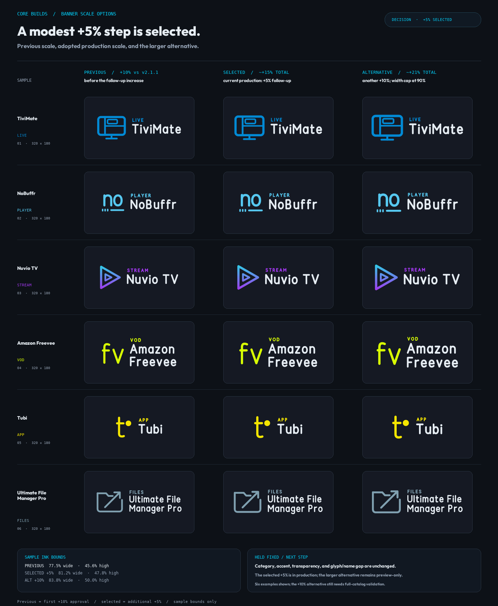

# Banner scale options — +5% selected

**Date:** 6 October 2026



The comparison informed the follow-up decision. The additional **+5%** option
was selected and is now the production scale. The +10% column remains an
unshipped alternative. The board compares the previous approved scale, the
selected production banners, and the larger alternative across six examples,
including several mark types and a long displayed name.

## Preview parameters

| Option | Glyph cap | Name max/min | Overall width budget | Status |
| --- | ---: | ---: | ---: | --- |
| Previous approved | 396 | 136 / 68 | 84% | historical |
| Follow-up +5% | 416 | 143 / 71 | 88.2% | selected; production |
| Follow-up +10% | 436 | 150 / 75 | 90% cap | preview only |

The +10% alternative caps its total lockup width budget at the validator's 90%
safe-area threshold. Actual name size remains fit-dependent; long labels may not
receive the full nominal increase. For all three, category size (46),
glyph/name gap (80 master units), accent, and transparent background are held
fixed.

Among the six examples, the widest/tallest measured ink extents are:

| Option | Width | Height |
| --- | ---: | ---: |
| Previous approved | 77.5% | 45.6% |
| Follow-up +5% | 81.2% | 47.8% |
| Follow-up +10% | 83.8% | 50.0% |

These are sample measurements, not a full-catalog validation of the unshipped
+10% alternative. The validator's limits are 90% width and 72% height. The
selected +5% version has been regenerated and validated pack-wide; the larger
alternative would need its own full render and validation before adoption.

Regenerate the decision receipt with:

```bash
python tools/build_banner_scale_options.py
```
