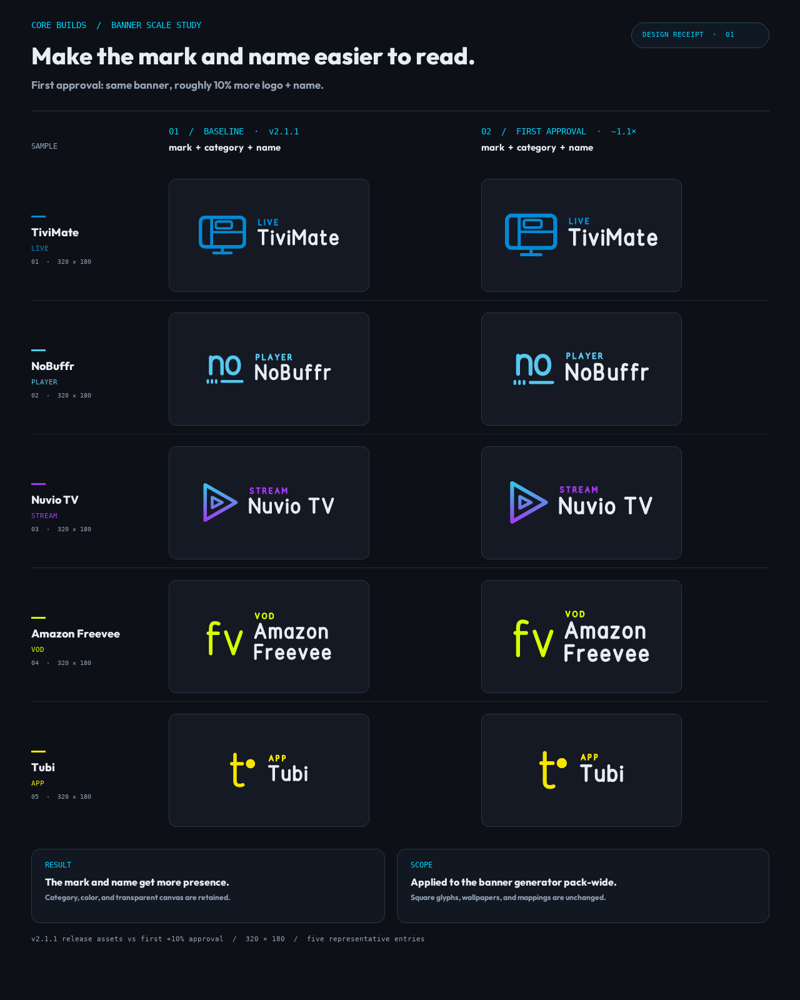

# Banner scale study — first approval

**Date:** 6 October 2026

**Interpretation:** “For the flags” refers to the pack's 16:9 banners. Support feedback asked for a more legible logo and app name. The category treatment is retained.

## First decision

The first approved change addressed legibility and differentiation without changing the visual style. It kept the monoline marks, category labels, per-app accents, and transparent launcher-owned card surfaces, while increasing the glyph cap and name size by about 10%. Category size and glyph-to-name gap stayed the same.

The five examples cover a screen mark, a distinctive word cue, a gradient mark, a long two-word name, and a compact monogram. The left column uses exact 320 × 180 release WebPs from the `v2.1.1` tag; the right is rendered with the frozen first-step settings.

A follow-up comparison led to another +5% increase, which is now in production. The selected +5% option and the considered +10% alternative are recorded in [`banner-scale-options-2026-10.png`](banner-scale-options-2026-10.png) and [its notes](banner-scale-options-2026-10.md).

## Scope

The final scale applies pack-wide. Categories, colors, mappings, square glyphs, and wallpapers are unchanged. The Heat family gets the same banner treatment; its square geometry is audited separately in `heat-family-review-2026-10.md`.

Regenerate this historical receipt with `python tools/build_banner_scale_study.py`. It writes only this study image; production banners are written by `tools/build_banners.py`.
