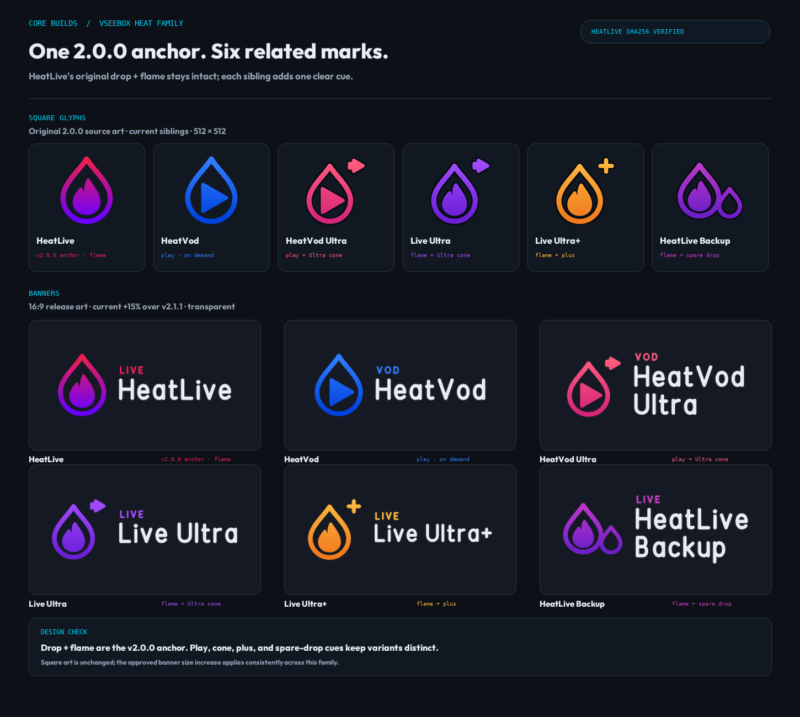

# Heat family review — v2.0.0 anchor

**Date:** 6 October 2026

**Scope:** HeatLive, HeatLive Backup, HeatVod, HeatVod Ultra, Live Ultra, and Live Ultra+.

## Audit result

I compared the original `v2.0.0` release with the current HeatLive artwork. Its source vector (`assets/svg/heatlive.svg`) and square raster (`heatlive.webp`) are byte-identical to that release. The design anchor is the point-up stroke teardrop around the solid flame, in the original rose-to-violet gradient.

The five later entries already used that construction as their visual source. I made the relationship explicit in `tools/glyphs.py`: the family now shares one canonical v2.0.0 drop path and flame construction instead of keeping a second copy of each. The variations remain purposeful and recognizable:

- **HeatVod:** play replaces the flame.
- **HeatVod Ultra:** same play, plus the tile's small play-cone cue.
- **Live Ultra:** original flame, plus the play-cone cue.
- **Live Ultra+:** original flame, plus the plus cue.
- **HeatLive Backup:** original flame, plus a smaller spare drop.

Colors and launcher mappings are unchanged. HeatLive's square glyph remains byte-identical to v2.0.0; its five siblings retain their existing square variations. The current ~15% mark/name scale over v2.1.1 is applied to the 16:9 banners, consistently with the rest of the pack.

The exact historical SVG hash is pinned in `tests/test_icon_identity.py`, and the review-image generator verifies the original square-art hash before drawing its board. Rebuild the receipt with `python tools/build_heat_family_review.py`.
