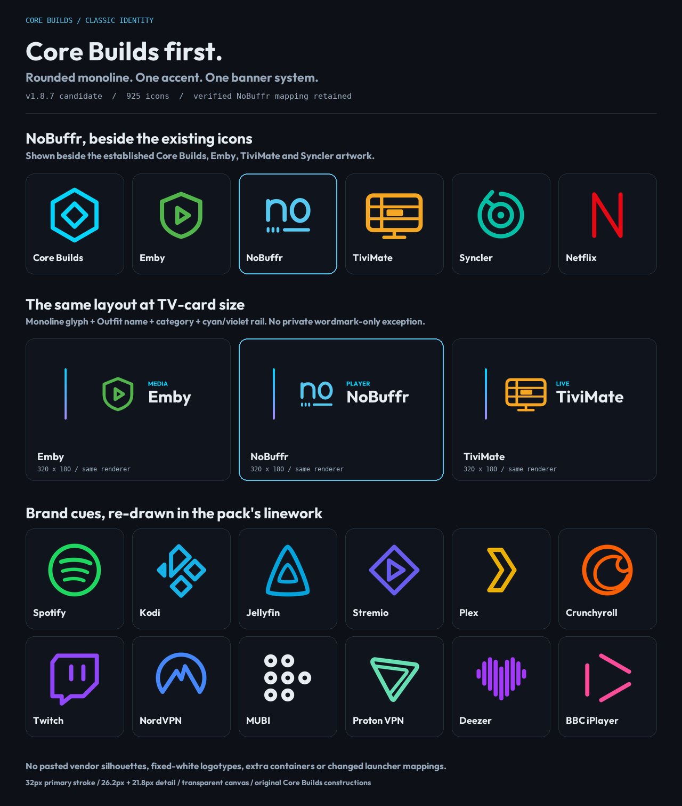

# Core Builds identity, brand cues and real requests — 8 September 2026

Scope: the **Classic Icon Pack v1.8.7 candidate**, with shared coverage in Pop
and Pixel Neon. **The pack's identity comes first.** This is not a collection
of unmodified vendor logos, nor a claim that all 925 entries have verified
brand artwork. Counts include regional/build variants. The 614 existing
Outfit letter-tile entries are unchanged by this style correction.

## Correction after visual review

The first pass solved some brand-reference problems but created a new one:
filled vendor silhouettes displaced Core Builds' rounded geometric linework,
and NoBuffr became a standalone white custom wordmark. **The user explicitly
rejected that loss of pack identity.** An isolated gallery of corrected logos
hid the mismatch with the rest of the pack.

The correction keeps the useful research, canonical colours, variant groups
and verified mappings, but changes the actual artwork acceptance criteria:

| Contract | Applied treatment |
|---|---|
| Authorship | Original constructions in `tools/glyphs.py`; no direct vendor-path registry |
| Main line | Canonical **32px**, round caps and joins |
| Detail | Existing **26.2px / 21.8px** subordinate weights, not flattened to 32px |
| Paint | One accent, transparent interiors, no solid vendor-logo slabs or fixed-white logotypes |
| Composition | Shared 512 grid and safe area; no extra host tile, glow or private scaling |
| Banner | Same monoline glyph + Outfit name + category + cyan/violet rail |
| Reference | Catalog `artwork` records are `usage: reference-only`, still local and hash-checked |
| Review | Mixed rows with unchanged Core Builds, Emby, TiviMate and Syncler neighbours; actual 320×180 banners |

The contract explicitly covers **18 brand constructions / 22 catalog entries**:
16 reviewed existing brands, the three iPlayer variants and NoBuffr, including
Paramount+ regional variants. It does not redesign the whole long tail or the
parent Core Builds mark.

### Recognisable cues, interpreted consistently

| Brand | Core Builds construction |
|---|---|
| Netflix | Clean upright N in rounded linework, not a filled ribbon slab |
| Spotify | Open ring and three subordinate curved strokes; `#1ED760` |
| Kodi | Split diamond/K in rounded outlines, not the former K-in-a-box |
| Jellyfin | Rounded nested triangular contours |
| Stremio | Diamond/play in monoline, not a filled vendor tile |
| Crunchyroll | Circular crescent/curl, not the old horizontal eye; `#FF5E00` |
| Twitch | Stepped chat contour and twin bars with rounded joins |
| NordVPN | Open dome and mountain peaks, not the generic shield |
| MUBI | Seven round **outlines in 2–3–2 rows**, readable in light ink |
| Deezer | Separated round-ended strokes forming the heart waveform; `#A238FF` |
| Proton VPN | Two contours suggesting the folded triangular ribbon |
| Plex | Outlined chevron; the name is the standard Outfit label, not vendor typography |
| Paramount+ | Mountain, snow fold and seven stylised star glints, simplified for TV rather than a filled seal |
| YouTube | Outlined button and play, with a genuinely transparent interior |
| YouTube Kids | Slanted button/play using the same line grammar |
| YouTube Music | Open disc/ring/play construction |
| BBC iPlayer | Three separate round-ended pink beams in play formation |
| NoBuffr | Lowercase **no** and the observed interrupted buffer underline, all in one accent |

The underlying brand-reference URLs, immutable source revisions, hashes and
rights are retained in [`tools/catalog.json` → `artwork`](../../tools/catalog.json).
They establish cues and colours, not a mandate to paste the vendor's artwork
into the pack. See [`THIRD_PARTY_NOTICES.md`](../../THIRD_PARTY_NOTICES.md).

## Colour and mapping fixes retained

### iPlayer and variant consistency

The v1.8.6 claim that BBC iPlayer should be BBC News red was incorrect. BBC's
2021 service refresh uses three blocks/beams in a play formation in shades of
pink. All three variants retain `#FF4C98`, now expressed in the pack's rounded
line weight, not large filled beams. This is an original interpretation, not
an imported or officially approved BBC asset.
[1](https://www.designweek.co.uk/issues/18-24-october-2021/bbc-logos-update/)

Seven curated groups still share one glyph and accent:

- BBC iPlayer / Freeview / TV
- 9Now / 9Now CTV
- Paramount+ / Canada / TVE
- Syncler / alternate package / Beta
- Weyd / Weyd Player
- SmartTube / SmartTube Next
- tvQuickActions / free build

9Now and the last four are consistency fixes to the existing primary entry,
not claims of newly verified vendor colours/artwork. Unrelated products are
not merged just because they share a primitive or similar name.

### Dark-card readability

The shared Classic colour policy remains: source accents below **3:1** on
`#0D1117` use `#E6EDF3` light ink. It currently affects **79 entries**. Squares,
banners and previews agree, while the original colour remains in the catalog
for provenance and sibling styles. The generated app list shows both values.
This is not a universal contrast guarantee for arbitrary wallpapers/cards or
an accessibility certification. The YouTube interior and equaliser faders use
real alpha, not a painted night-colour plug.

## NoBuffr: correct identity, uniform artwork

NoBuffr is an M3U/XTREAM player whose vendor lists Android and Android TV among
its supported platforms. This task is a direct user request, not an inferred
market-share ranking. [1](https://nobuffr.com/)

The exact supplied APK was downloaded on a GitHub Actions runner after the
workspace could not reach its host, then **statically inspected, not executed**:

- URL: <https://downloads.nobuffr.com/android/nobuffr.apk>
- Observed version: `1.0.0` / `210246`; 33,628,207 bytes.
- SHA-256: `ec835a672087b5cb56700ddc3ed4e050519f5829d10e86800d5506d79afda5bf`.
- Actual component: **`com.nobuffr.app/tv.tivitime.compose.app.AppActivity`**.
- MAIN launcher intents include phone `LAUNCHER` and TV `LEANBACK_LAUNCHER`.

**None of that mapping evidence changes with the style correction.** The
activity is in another namespace; `com.nobuffr.app/.MainActivity` is not a valid
substitute. The receipt and original resources are retained in
[`tools/reference/nobuffr/`](../../tools/reference/nobuffr/). No APK is committed
or bundled; the one-off download workflow was removed.

The observed source logo has stacked **no / buffr** lettering and an interrupted
underline. The rendered Classic icon now reduces this to a **single-accent,
rounded-line no + interrupted underline** motif. Its full name appears in the
standard Outfit-labelled PLAYER banner with the Core Builds rail. The traced
white wordmark is reference-only and no longer a rendering option. This is a
Core Builds interpretation, not a claim to reproduce every vendor letter.

All three packs retain their square/banner resources and exact component
mapping. Pop consumes the revised base geometry within its own container/ink
style. Pixel Neon keeps its independent pixel construction.

## Which icons do people actually need next?

### Method and limitations

This is a qualitative request audit, not a popularity poll. Named requests in
public Projectivy threads, a maintainer discussion and official store links
were checked against the live catalog by **name, drawable and package**. A
missing README word is not proof of a missing icon. The reference pack's issue
tracker was disabled when checked; no live issue-count or download ranking is
invented here.

Community comments stress whole-row transparent consistency and working
automatic mapping, rather than simply a larger advertised count.
[1](https://www.reddit.com/r/Projectivy_Launcher/comments/1mjkdhs/request_transparent_icon_pack/)

### Prioritised queue

| Priority | Request | Evidence | Our status / next action |
|---|---|---|---|
| P0 | **NoBuffr** | Direct task request; vendor Android/TV support [1](https://nobuffr.com/) | **Added**, APK-verified mapping retained, artwork corrected to Core Builds style |
| P1 | **TDUK Cache Cleaner** | Explicit request alongside Unlinked/Analiti [3](https://www.reddit.com/r/Projectivy_Launcher/comments/1j3848y/borderless_transparent_icons/) | Genuine gap; obtain a legitimate APK/device component and current logo reference |
| P1 | **TDUK App Killer** | Named with Cache Cleaner in the launch thread [2](https://www.reddit.com/r/Projectivy_Launcher/comments/1mtmall/introducing_the_projectivy_icon_pack/) | Genuine gap; not the already-covered TDUK Screensaver Manager |
| P1 | **Tata Play Binge** | Explicit request with Play link [1](https://www.reddit.com/r/Projectivy_Launcher/comments/1j3848y/borderless_transparent_icons/) | Genuine gap; verify the TV activity, not just mobile package `com.tataskymore.open.uat` |
| P1 | **Wholphin artwork** | Dedicated request; maintainer points to source artwork [1](https://github.com/damontecres/Wholphin/discussions/312) | Already `damontecres_2`, still a D tile; improve its Core Builds interpretation, not the icon count |
| P2 | **Beacon Game Launcher** | Explicit Projectivy request [2](https://www.reddit.com/r/Projectivy_Launcher/comments/1mtmall/introducing_the_projectivy_icon_pack/); official launcher listing [2](https://play.google.com/store/apps/details?id=com.radikal.gamelauncher&hl=en_US) | Genuine gap; verify TV/controller use and legitimate installed-build component, never a cracked APK |
| P2 | **Nuvio TV artwork** | Named request in the transparent-icon thread [1](https://www.reddit.com/r/Projectivy_Launcher/comments/1j3848y/borderless_transparent_icons/) | Already `nuvio`; next reference-informed style pass, not new coverage |
| P2 | **ZEE5 logo update** | Request specifically asks for the new logo [1](https://www.reddit.com/r/Projectivy_Launcher/comments/1j3848y/borderless_transparent_icons/) | Already `graymatrix`; verify current cues and adapt them to the pack |
| P3 | **ActionDash / Wavelet** | Named in the same request list [1](https://www.reddit.com/r/Projectivy_Launcher/comments/1j3848y/borderless_transparent_icons/) | Absent; establish TV relevance/launchability before prioritising phone-list requests |

The reference pack's historical release marks TDUK Cache Cleaner/App Killer as
**manual assignment only**. Their existence in another pack is not evidence
of a working launcher component.
[1](https://newreleases.io/project/github/SicMundus86/ProjectivyIconPack/release/1.0.1)

### Requests with existing mappings

The thread also requests NordVPN, UniFi Protect, Tubi, Pluto TV, S0undTV, PBS,
tvQuickActions, GeForce Now, File Manager+, Button Mapper, PrivadoVPN,
Background Apps and Process List, Aerial Views, Proton VPN and others.
[1](https://www.reddit.com/r/Projectivy_Launcher/comments/1j3848y/borderless_transparent_icons/)

| Requested name | Existing catalog entry |
|---|---|
| ZEE5 | `graymatrix` |
| Analiti | `fastest` |
| GeForce Now | `tegrazone3` |
| Wholphin | `damontecres_2` |
| S0undTV | `s0undtv` |
| Nuvio TV | `nuvio` |
| Kayo / Kick / Unlinked | `kayo` / `kick` / `unlinked` |
| File Manager+ | Its package shares `cxinventor`; identity review/split needed |

Those mappings are verified against the local catalog, not inferred from the
thread. File Manager+ is a warning against treating any mapping as finished:
`com.alphainventor.filemanager` shares the CX File Explorer entry, so it still
needs a separate source-checked identity. This pass remains **924 → 925**, not
an inflated count that treats existing aliases as new apps.

## Admission and regression rules

1. Obtain an official link and real TV component, or statically inspect an APK.
   Never invent an activity to increase the count.
2. Keep version/hash, observed launcher categories and artwork-reference
   provenance. Manifest verification and device testing are different claims.
3. Dedupe names, drawables, packages, regional builds and developer-named entries.
4. **Adapt the cue to Core Builds.** A source reference is not permission to
   bypass the uniform line/colour/typography/banner system.
5. Regenerate the affected packs and inspect the new icon alongside established
   neighbours, at actual TV sizes. A correct isolated logo is insufficient.

`tests/test_icon_identity.py` now has **35 regressions**: the original evidence,
colour, mapping and static-inspection checks, plus style gates, mutation tests,
open-ink/safe-area checks and the exact common banner recipe. It rejects fills,
fixed-white logotypes, square caps, overweight strokes, private transforms and
wordmark-only exceptions. The previous NoBuffr silhouette-similarity test was
replaced because it rewarded the result the user rejected; APK/hash/component
checks remain intact.

Source and generated-SVG style checks also run in the Classic validator, and
Classic/Pop share catalog validation. Pixel Neon's validator continues to
verify the exact mapping set and catalog-derived counts.

**Not claimed here:** physical-device Projectivy auto-assignment, contrast on
every possible card/wallpaper, official brand approval, or a full long-tail
logo audit. Android compilation, lint and emulator results are recorded for
the particular PR head, separately from Python rendering receipts.
