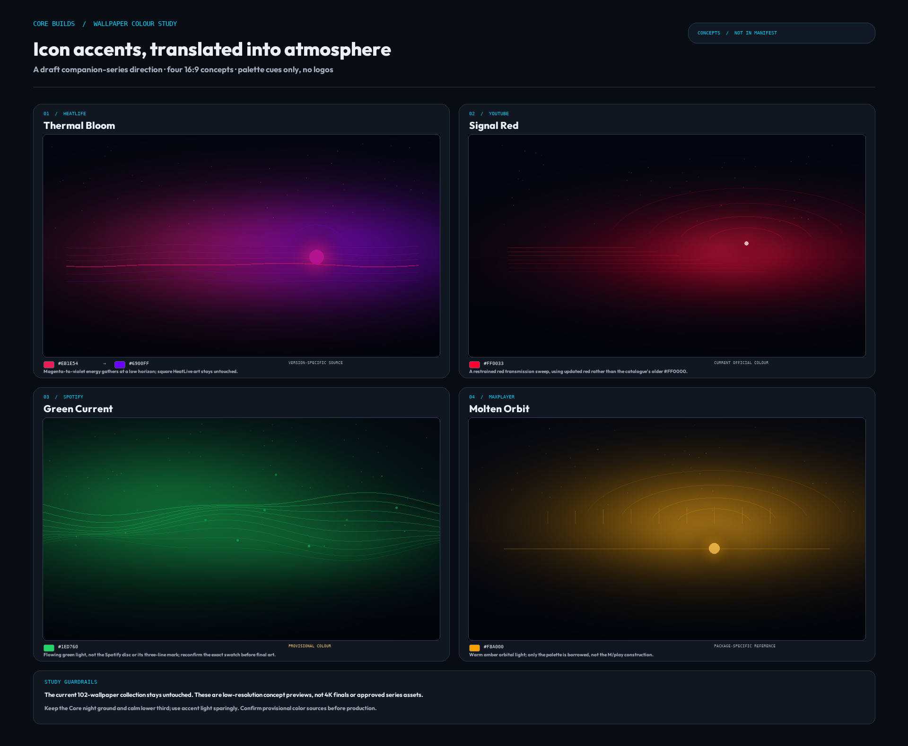

# Icon-colour wallpaper study — 2026-10

**Status:** concept exploration only. The board is not a release set and is not in the wallpaper manifest.

## Direction

Build a **separate companion series** around a few distinctive catalogue accents, while preserving the current 102-wallpaper collection exactly as it is. These four low-resolution studies keep the Core night ground, a quiet lower third for launcher UI and restrained atmospheric light. They use palette cues only—no vendor logos, icon outlines or copied icon geometry.

The concepts are deliberately different enough to test a palette range:

| Study | Icon colour cue | Recorded source/confidence | Concept treatment |
|---|---|---|---|
| Thermal Bloom | HeatLive `#EB1E54 → #6900FF` | APK-derived adaptive-icon gradient, HeatLive 5.0.3; version-specific reference | Magenta-to-violet horizon bloom; the HeatLive square glyph is untouched. |
| Signal Red | YouTube `#FF0033` | Current official YouTube logo/icon colour, checked 2026-10; the catalogue still has `#FF0000` | Fine red signal sweep, not a play button or logo. |
| Green Current | Spotify `#1ED760` | Current catalogue accent; its `color_source` is still marked pre-provenance/unverified | Organic flowing ribbons, not the Spotify disc or three-wave mark. **Provisional until color provenance is refreshed.** |
| Molten Orbit | MaxPlayer `#F8A000` | Exact-package Google Play listing icon for `tv.maxplayer.android`, sampled 2026-10-03 | Warm amber orbital light; no M/play construction. |

YouTube's current value and misuse guidance are on its [official logo](https://brand.youtube/youtube-logo/) and [icon](https://brand.youtube/youtube-icon/) pages. MaxPlayer's source is its [exact-package Play listing](https://play.google.com/store/apps/details?id=tv.maxplayer.android). HeatLive's reference and color extraction notes are recorded in [`tools/catalog.json`](../../tools/catalog.json). Spotify remains provisional in the catalogue; the concept is included to test the look, not to certify the swatch.

## Production boundary

- No source image under `Wallpapers/` was edited, overwritten or copied into a release series.
- `Wallpapers/manifest.json`, bundled thumbnails and the app's wallpaper index were not changed.
- The panels are **840×472 concept previews**, not final 3840×2160 wallpapers.
- No palette is approved for production by this study. Confirm provisional color provenance and choose which directions to carry forward before generating full-resolution art.

## Reproducibility

Run `python tools/build_wallpaper_icon_palette_study.py` with `tools/requirements.txt` installed. The script writes only `docs/research/icon-wallpaper-palette-study-2026-10.png`.
