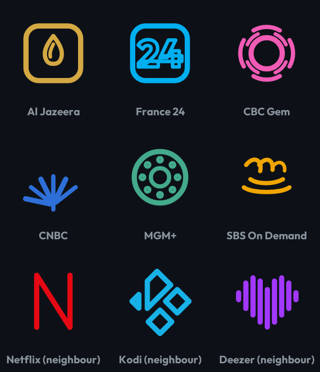

# Upgrading the Core Builds Icon Pack design — benchmarked against Projectivy Icon Pack

Research date: **11 September 2026**. Companion to, and deliberately not a
repeat of, the three existing streams this repo already holds:

- [`COMPARISON.md`](../COMPARISON.md) — coverage/parity vs Projectivy 1.1.9
- [`android-tv-icon-packs.md`](android-tv-icon-packs.md) — what makes a TV icon
  pack good, and where Core Builds leaves value on the table
- [`icon-fidelity-and-demand-2026-09.md`](icon-fidelity-and-demand-2026-09.md) —
  the v1.8.7 identity correction and the current art acceptance contract
- [`../logo-research/ICON_LOGO_RESEARCH.md`](../logo-research/ICON_LOGO_RESEARCH.md) —
  the 921-row per-app logo-fidelity audit

Those answer *coverage*, *format*, and *identity*. This one answers the question
nobody has written down end-to-end: **given that Core Builds already beats
Projectivy Icon Pack on almost every measurable, what is the specific, ordered
list of *design* upgrades that close the one axis we still lose on?**

---

## 0. TL;DR

Core Builds Icon Pack wins on everything **structural** — coverage (926 vs ~980
selectable names), mappings (1,646 vs 962 emitted rows), 16:9 banners, dual
component spellings, `<queries>` direct-apply, in-app browser/updater,
wallpapers. Projectivy Icon Pack wins on exactly one thing, and it is a
**design** thing, not a coverage thing:

> **One bespoke, recognisable mark per app.**

Projectivy ships ~872 distinct art IDs for ~980 names — roughly one unique
drawing per app. Core Builds ships **268 distinct glyph shapes for 926 icons,
and 615 of those icons (66%) are one of 29 letter tiles** (`tile_A`…`tile_Z`).
Measured from `tools/catalog.json` on this branch.

That is the entire gap. Every recommended upgrade below is a step toward
closing it **without** giving up the Core Builds monoline identity, which the
user explicitly re-affirmed in v1.8.7 and which is the pack's only real moat.
The short version of the plan:

1. **P0 — Raise per-app recognisability.** Extend the v1.8.7 "recognisable cue,
   interpreted consistently" pass from 18 brand constructions to the ~93
   researched brands in `ICON_LOGO_RESEARCH.md`, and add a measured
   glyph-diversity gate so the 66% letter-tile share can only go down.
2. **P1 — Optical size normalisation.** Kill the >2× mark-size variance (Pop
   already built the mechanism in `tools/popart.py`; port the *idea*, not the
   container).
3. **P1 — Palette discipline.** 194 accents is "effectively unbounded"; snap
   saturation/value without collapsing to Pop's 16 swatches.
4. **P2 — Product-design parity.** Back-port the Projectivy internal-activity
   cards, add the issue-template/troubleshooting process Projectivy has, and
   get the distribution surface (Play listing, Downloader code) to match.

---

## 1. The benchmark: what Projectivy Icon Pack's design actually is

Projectivy Icon Pack ([SicMundus86/ProjectivyIconPack](https://github.com/SicMundus86/ProjectivyIconPack))
is the reference implementation for this launcher, and the only real design
competitor. Live repo state (fetched 2026-09-11): **447 stars**, last commit
Apr 2026, and a banner note that the maintainer is "taking a short break from
taking requests". It is built on [Blueprint](https://github.com/jahirfiquitiva/Blueprint).

Its design stance, in its own words ([README](https://github.com/SicMundus86/ProjectivyIconPack)):

- **"All icons are custom-made to deliver a modern and consistent look"** —
  bespoke artwork per app, not a system.
- **"Transparent backgrounds** that enhance visual consistency and allow you to
  assign your preferred background colors in the launcher."
- **"Designed to look their best on darker backgrounds"** — dark-card-first,
  exactly like Core Builds.
- Designed and tested on **Android / Google TV**; mobile variants are
  explicitly unsupported.

### The structural fact that matters

The decoded 1.1.9 mapping snapshot committed at
`tools/reference/projectivy-1.1.9-appfilter.xml` gives us a design number that
the README doesn't:

| Design metric (1.1.9) | Projectivy | Core Builds (this branch) |
| --- | ---: | ---: |
| Selectable app names | ~980 | 926 |
| **Distinct mapped art IDs** | **872** | **268 glyph shapes** |
| Art-per-name ratio | **~0.89 (near 1:1)** | **0.29** |
| Share of rows on generic letter tiles | ~0 | **66%** |

The takeaway is unambiguous: **Projectivy is a curated art collection; Core
Builds is a designed system with a curated art layer on top of a letter-tile
floor.** Each approach has a real cost:

- Projectivy's cost: consistency is asserted, not enforced (no generator, no
  validator), and there is no banner/size discipline.
- Core Builds' cost: **two thirds of the grid is unidentifiable by shape** — on
  a TV read at ~3 m, those apps are found by the text label Projectivy draws
  under the card, not by the mark.

That second cost is the thing to design our way out of.

---

## 2. What Core Builds Classic actually is today (measured)

Numbers computed from `tools/catalog.json` on `arena/01a08f5f-corebuildsapps`,
not from the README:

| Property | Value | Reading |
| --- | ---: | --- |
| Icons | 926 | best-in-class TV coverage |
| Categories | 21 | APP is 551/926 (~60%) |
| Distinct glyph shapes | 268 | 239 bespoke + 29 letter tiles |
| Icons on a letter tile (`tile_A`…`tile_Z`) | **615 (66.4%)** | a monogram in a rounded box |
| Icons on a bespoke mark | **311 (33.6%)** | original geometry |
| Distinct accent colours | 194 | effectively unbounded |
| Light-ink entries (3:1 floor on `#0d1117`) | 79 | derived, not stored |
| Unverified component mappings | 436 | hardware evidence still outstanding |

The top of the bespoke tier is thin: `iptv_player` (14), `folder` (9),
`browser_globe2` (5), `play_round` (5), `comedy_mark` (5), `sync_ring` (5) —
several of these are category glyphs reused across unrelated apps, not
per-app marks. Only ~17 artwork records exist in the catalog (`artwork` keys
such as `netflix_ribbon`, `spotify_arcs`, `kodi_box`), i.e. ~17 brands have
deliberately constructed, reference-informed marks.

### What v1.8.7 already fixed, and why it constrains us

The 8 September 2026 correction ([`icon-fidelity-and-demand-2026-09.md`](icon-fidelity-and-demand-2026-09.md))
is the contract any upgrade must respect. The first pass replaced Core Builds
linework with **filled vendor silhouettes** and gave NoBuffr a standalone white
wordmark — and the user rejected it for losing the pack's identity. The
correction re-established:

- 32 px canonical main line, round caps/joins; 26.2 / 21.8 px detail
- one accent per glyph, transparent interiors, no solid vendor slabs
- the same monoline glyph + Outfit name + category + cyan/violet rail in every banner
- `artwork` catalog records stay `usage: reference-only`

So the upgrade path is **not** "make it look like Projectivy's filled logos".
It is: *keep the line language, raise the recognisability* — which is exactly
what the 18 corrected brands (Netflix N, Spotify ring, Kodi split-diamond,
Jellyfin nested triangles, Crunchyroll crescent, MUBI seven dots, …) prove is
possible.

---

## 3. The one-sentence design gap

> **Projectivy is recognisable per app and inconsistent overall; Core Builds is
> consistent overall and unrecognisable per app for two thirds of the grid.**

Everything in §4–§8 is a plan to move the "unrecognisable per app" fraction
down while holding the "consistent overall" moat.

---

## 4. Design dimensions — side by side

| Dimension | Projectivy Icon Pack | Core Builds Classic | Verdict / action |
| --- | --- | --- | --- |
| Per-app recognisability | **Strong** — bespoke art ≈1:1 | Weak — 66% letter tiles | **P0** (biggest gap) |
| Uniformity | Asserted, not enforced | **Enforced** by generator + 35 regressions | keep, never regress |
| Distinctive identity | Generic "colourful flat logo" | **Owned** monoline + halo + hex language | the moat — protect it |
| Optical mark size | Varies (no system) | Varies >2× across bespoke marks | **P1** normalise |
| Palette | Unbounded, arbitrary | 194 accents (unbounded) | **P1** discipline S/V |
| Dark-card handling | "use a dark card" tip | 3:1 floor, light-ink fallback | **already ahead** |
| Banner (320×180) | Square-first; banners optional | **Every app ships one**, wordmark-free rail | already ahead |
| Mapping depth | full names mostly | full + short spellings | already ahead |
| In-app product design | Blueprint app shell | TV-first Compose/View app, brand chrome | keep; see §7 |
| Community process | **Issue templates + troubleshooting** | none | **P2** — cheapest win |
| Distribution | GitHub + **Play Store** + Downloader | GitHub + Downloader | **P2** |

---

## 5. Upgrade opportunities, prioritised

### P0 — Bespoke marks for the researched brands (kill letter tiles where it matters)

**What.** Extend the v1.8.7 pass from 18 brand constructions / 22 catalog
entries to the full set of recognisable brands already researched in
[`ICON_LOGO_RESEARCH.md`](../logo-research/ICON_LOGO_RESEARCH.md). That audit
already distinguishes "real public emblem" from "wordmark-only / unknown" and
names the specific divergences. High-value examples it flags, in order of
recognition:

| Brand | Today | Researched cue to interpret |
| --- | --- | --- |
| Disney+ | plus/star | the signature Disney "D" + plus |
| ESPN | E in a ring | the cut "E" block |
| MGM+ | M ribbon | lion in film-reel ring + plus |
| NBA | basketball | player silhouette in shield |
| MLB | diamond outline | batter silhouette in diamond |
| Deezer | varied-height bars | equal-bar staircase matrix |
| Al Jazeera | tile A | orange square + calligraphic flame |
| France 24 | tile treatment | cyan square + white "24" |
| JustWatch | magnifier + play | left-edge play geometry |
| Crunchyroll | symmetric eye | offset crescent/pupil |
| BritBox | stacked chevrons | rounded box + union cross |
| Google Play Games | circle + G | play triangle + controller |
| Kayo | bolt | wordmark + sport wave |
| Mullvad VPN | shield + M | duck head |

Each becomes a **Core Builds construction** — rounded linework, one accent,
transparent — exactly like the v1.8.7 Netflix/Spotify/Kodi treatments, never a
pasted logo. The audit's own resolution rule already says this: *"Recognise a
brand only where it has a real public emblem; otherwise keep the consistent
tile — never invent a vendor logo."*

**Why it matters.** This is the single highest-leverage move: it converts the
~90 recognisable brands from "letter tile" to "identifiable at 3 m" without
touching the long tail, and it directly attacks the 66% number at the point of
highest user value.

**Cost.** Art + one catalog glyph entry + one `artwork` reference record per
brand, then `python3 tools/build_icons.py && python3 tools/build_banners.py &&
python3 tools/validate.py`. The long tail stays untouched.

**Guardrail.** Reuse the v1.8.7 review discipline: mixed rows against unchanged
Core Builds / Emby / TiviMate / Syncler neighbours, at actual 320×180 and
512×512, not an isolated gallery.

### P0 — A measured glyph-diversity gate

**What.** Add a regression (in `tests/test_icon_identity.py`, which already has
35) that asserts the recognisability trend can only improve:

- share of icons on `tile_*` glyphs (currently **66.4%**) — assert a ceiling;
- count of icons on bespoke marks (currently 311) — assert a floor;
- no *named* brand in the researched set silently regresses to a tile.

**Why.** Style gates already exist; a *diversity* gate does not. Every future
catalog addition currently lands on a letter tile by default, so the 66% number
ratchets **up** with each release. A gate flips that default.

**Cost.** ~40 lines in the test file; the catalog already carries `glyph` per
row.

### P1 — Optical size normalisation (port Pop's rule 3, not Pop's container)

**What.** Bespoke marks currently vary by more than 2× in optical size
([`iconpack-demand-2026.md`](iconpack-demand-2026.md) §3). Normalise every
mark to a shared ink box / optical area — the mechanism `tools/popart.py`
already implements for Pop — while keeping Classic's transparent, containerless
treatment.

**Why.** Size variance reads as "sloppy grid" next to the uniformity claim, and
it undercuts the 3:1 contrast floor for the small marks. Pop's letters roughly
doubled in size under this rule, which was called the biggest legibility win in
the pack.

**Cost.** Port the optical-normalisation from `popart.py` into `tools/icon_style.py`
or `glyphs.py`; add an invariant to `validate.py`.

**Guardrail.** Pop normalises *into a container*; Classic must normalise *onto
the transparent grid*. The hex stance rule ("the point-up hexagon is
load-bearing") and the 432 safe area stay.

### P1 — Palette discipline (discipline S/V, keep hue-as-language)

**What.** 194 accents is effectively unbounded and produces the "rainbow noise"
that Pop was built to fix — but collapsing to Pop's 16 swatches would erase
Classic's own identity. The middle path: keep each app's hue, snap saturation
and value onto a small set of approved steps, and keep the existing 3:1 light-ink
fallback (79 entries).

**Why.** Per-app hue is carrying meaning (Netflix red, Spotify green, Plex
amber); raw S/V variance is not. This tightens the "consistent overall" moat
without becoming Pop.

**Cost.** A hue-preserving S/V snap in the colour pipeline + a validator check;
re-run the preview sheets to eyeball the diff.

### P1 — Banner legibility at TV distance (verify, don't assume)

**What.** `tools/build_variant_markonly.py` already measured that a
wordmark lockup renders glyphs at 30–39 px against neighbours at 48–100 px and
drops the category kicker to 6.4 px — which is why banners are wordmark-free.
That decision is settled. The open item is **verifying the current rail layout**
at 320×180 on a real device: glyph optical size, kicker size, and whether the
category rail survives Projectivy's actual card scaling.

**Why.** Banners are the pack's single biggest competitive asset (the community
is unambiguous that 320×180 is the correct size); they should be the most
hardware-verified surface, not the least.

**Cost.** One screenshot pass on a TV. Record it like
[`DEVICE_FINDINGS.md`](../DEVICE_FINDINGS.md) already does for other claims.

### P2 — Tile-system consistency

**What.** The 29 letter tiles (`tile_A`…`tile_Z`) are the floor for the long
tail; make the floor look deliberate — consistent corner radius, letter optical
centring, weight, and accent placement across all 615 rows.

**Why.** The long tail will stay tile-based for a long time (they're
wordmark-only apps); the floor should look like a designed system, not a
default.

**Cost.** Small; `glyphs.py` already centralises tile construction.

### P2 — Phone-side flourishes (low TV value, note only)

Dynamic calendar (`<calendar prefix="…"/>`) and themed icons
(`grayscale_icon_map.xml`) are standard and cheap in the generator, but their
TV value is near zero. Only worth it if the pack is ever marketed to phones —
which our manifest intent-filters technically allow.

---

## 6. What not to do (anti-goals, from the v1.8.7 correction)

These are the traps the last correction already tripped, restated as a
permanent guardrail list for any future "upgrade":

1. **Do not paste vendor logos or trace vendor paths.** Reference-only, always.
   `tests/test_icon_identity.py` rejects fills, fixed-white logotypes, square
   caps, overweight strokes, private transforms and wordmark-only exceptions.
2. **Do not add a container.** That is Pop's thesis; Classic is transparent by
   design so the launcher owns the card colour.
3. **Do not collapse to 16 swatches.** That is Pop's identity; Classic keeps
   hue-as-language.
4. **Do not inflate counts with invented activities or merged lookalikes.** The
   pack reports layers honestly; a mapping without hardware evidence stays
   `unverified`.
5. **Do not make banners wordmark lockups.** Measured (30–39 px glyphs, 6.4 px
   kicker); the decision is closed.

---

## 7. Product-design parity (the design of the *experience*, not the pixels)

The user-facing "design" of the pack is also its process and distribution,
where Projectivy still leads and the gap is cheap to close.

| Item | Projectivy | Core Builds | Action |
| --- | --- | --- | --- |
| Icon-request issue template | ✅ | ❌ | copy the structure; `ISSUE_TEMPLATE` |
| Mapping-bug issue template | ✅ | ❌ | copy, incl. "include component name" |
| Icon-improvement template | ✅ | ❌ | add, with "attach an image" |
| Troubleshooting section | ✅ (5 known quirks) | partial | port verbatim — manual-assign, re-apply, cache restart, activity-change |
| Projectivy internal cards (4.70) | ❌ | **Pop only** | **back-port to Classic** — transparent style, no container, fits perfectly |
| Fallback masking (`iconback`…) | ❌ | Pop only | **do not add to Classic** — transparent design has no container to give; document why |
| Play Store listing | ✅ | ❌ | P3, only if phone/TV reach is wanted |
| Downloader code | ✅ `9257057` | Classic `5270601`; **Pop missing** | allocate a Pop code before first `pop-v*` |

The **Projectivy internal-activity cards** deserve specific call-out: Classic
already has `gear`, `folder`, `tv_stack`, `launcher_grid`, `home_button` and
`remote` in `tools/glyphs.py`, so back-porting Pop's internal-activity mapping
(settings, categories, channels, HDMI 1–4 / AV inputs, both name forms) is
pure mapping work — zero new art — and it directly answers the posted request
that no pack (including Projectivy's) had filled
([r/Projectivy_Launcher](https://www.reddit.com/r/Projectivy_Launcher/comments/1icfbn7/how_to_i_install_icon_packs_also_can_i_make_my/)).

---

## 8. Recommended sequence

Ordered so each step is independently shippable and low-risk:

1. **Back-port Projectivy internal cards to Classic** (mapping only, no art) —
   instant parity-plus, answers a real request.
2. **Add the glyph-diversity gate** (P0 gate) — locks in a floor before any art
   work begins.
3. **Bespoke pass on the ~93 researched brands** in priority order from
   `ICON_LOGO_RESEARCH.md` (P0 art) — one PR per ~10 brands, each with a mixed
   review sheet.
4. **Optical size normalisation** (P1) — after the new marks exist, so they're
   born normalised.
5. **Palette S/V discipline** (P1) — after size, so the preview diff is clean.
6. **Issue templates + troubleshooting section** (P2) — do any time; it's the
   cheapest quality multiplier and needs no art.
7. **Device pass** — banner legibility, mask polarity (Pop), 1:1 card behaviour;
   one evening settles all of it.
8. **Distribution** — Pop Downloader code, then evaluate Play Store.

**Success metric:** letter-tile share 66% → ≤45%, bespoke-mark share 34% →
≥55%, optical size variance >2× → ≤1.25×, while `tests/test_icon_identity.py`
still passes and no vendor logo is ever pasted.

---

## 9. Sources and open questions

In-repo: [`COMPARISON.md`](../COMPARISON.md),
[`iconpack-demand-2026.md`](iconpack-demand-2026.md),
[`android-tv-icon-packs.md`](android-tv-icon-packs.md),
[`icon-fidelity-and-demand-2026-09.md`](icon-fidelity-and-demand-2026-09.md),
[`../logo-research/ICON_LOGO_RESEARCH.md`](../logo-research/ICON_LOGO_RESEARCH.md),
[`android-tv-ui-2026-09.md`](android-tv-ui-2026-09.md),
[`tools/reference/projectivy-1.1.9-appfilter.xml`](../../tools/reference/projectivy-1.1.9-appfilter.xml).

External: [Projectivy Icon Pack](https://github.com/SicMundus86/ProjectivyIconPack)
(live README fetched 2026-09-11), [Projectivy Launcher releases / issue #512](https://github.com/spocky/miproja1/issues/512),
[Lawnchair icon-pack spec](https://github.com/LawnchairLauncher/lawnchair/wiki/Icon-pack-support),
[Android TV app-icon guidance](https://developer.android.com/design/ui/tv/guides/system/tv-app-icon-guidelines).

**Open / unverified (need hardware, not more reading):**

- Does Projectivy honour `iconback`/`iconmask`/`iconupon` and in which alpha
  polarity? (Blocks nothing for Classic — we don't ship them — but settles the
  Pop fallback claim.)
- How does Projectivy render a 16:9 banner on a 1:1 card — letterbox or
  centre-crop? (Determines whether a square-mapped variant APK is ever needed.)
- Do the new 4.70 internal-activity mappings survive a real Projectivy build?
  (Pop ships them; Classic would inherit the same `unverified` status.)

---

## 10. Implementation status (11 September 2026)

First tranche landed on this branch (see the accompanying PR).

- **P0 gate shipped** — `tests/test_icon_identity.py` gains `DiversityTests`:
  letter-tile share ceiling (66%), bespoke-mark floor (315), and a
  researched-emblem set that may never fall back to a tile.
- **First six brand marks shipped** (all hold the core_monoline contract —
  one accent, round caps, 32/26.2/21.8 weights, no fills):
  | App | Before | After |
  | --- | --- | --- |
  | Al Jazeera | `tile_A` | `aljazeera_flame` — gold square + flame/teardrop |
  | France 24 | `tile_A` | `france24_mark` — cyan square + stroked Outfit "24" |
  | CBC Gem | `tile_C` | `cbc_gem` — the "exploding pizza" ring + arc fragments |
  | CNBC | `tile_C` | `cnbc_peacock` — six-feather peacock fan |
  | MGM+ | `mgm_mark` (M ribbon) | `mgm_reel` — film reel with perforations |
  | SBS On Demand | `tile_S` | `sbs_bars` — the five-splice Mercator globe |

  Tile share drops 66.4% → 65.9%; bespoke marks rise 311 → 316. Classic and
  Pop regenerated and validated; Pixel Neon's committed sprites are
  intentionally untouched (its recipes fall back to category silhouettes for
  new cues — a dedicated Pixel Neon recipe pass for these six is the follow-up).

**Remaining researched queue** (from `ICON_LOGO_RESEARCH.md`, §"Priority fix
list"): Disney+ "D+", Kayo wave, Foxtel fox, Rakuten red wedge, Vimeo
wordmark, Peacock wider fan, NFL/MLB/NBA shields, CNN curved bars, ESPN cut-E,
Red Bull bulls, Mullvad duck head, BritBox union cross, plus the long-tail
tile floor and the P1 palette/size passes.
