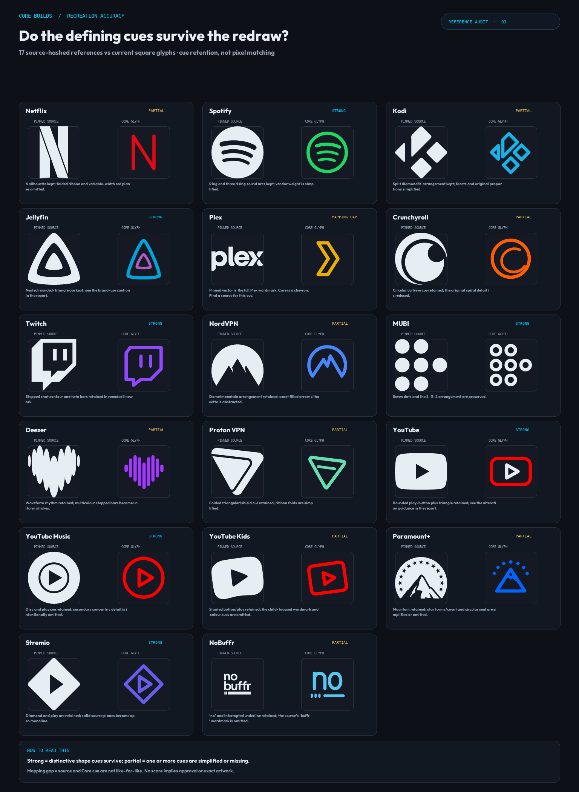
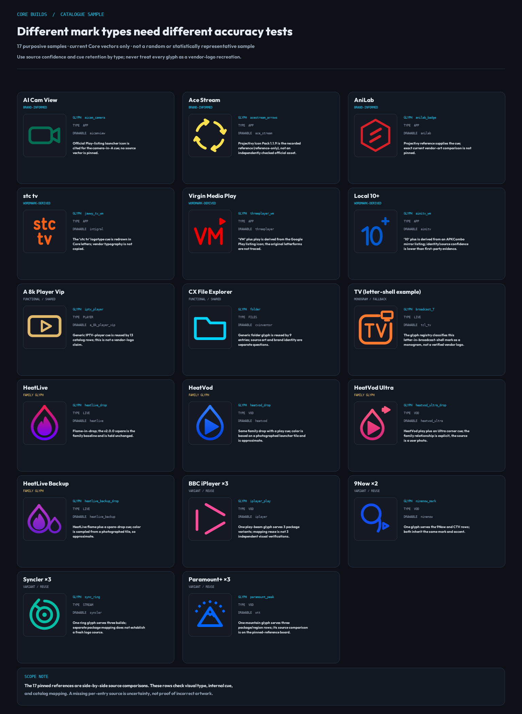

# Whole-catalogue recreation-accuracy research audit

**Review date:** 2026-10-06
**Scope:** current 981-entry catalogue
**Outcome:** research and review artifacts only; no production artwork changed for this audit.

## Executive readout

The catalogue is a **Core Builds icon system**, not a 981-logo trace pack. It contains brand-informed redraws, wordmark cues, family constructions, shared functional glyphs and entries whose source/type is not yet recorded. Accuracy therefore needs to be judged by identity/mapping confidence and retention of the intended cue *within Core Builds' rounded-monoline language*—not by a single pixel-overlap score.

The full-catalogue metadata census covers all 981 rows. It finds **905 distinct glyph IDs**, with **560 rows describing a glyph source** (339 brand-informed redraws and 221 wordmark-derived marks) and **421 rows without a per-entry `glyph_source`**. Those 421 are a provenance/classification queue, not 421 proven artwork errors. The catalogue has no explicit per-entry mark-type field that reliably separates brand marks, wordmarks, functional/fallback marks, family glyphs and aliases. The glyph registry does explicitly classify letter-in-container monograms: `is_monogram()` matches 19 rows across 14 glyph IDs. That narrow count is not the total functional/fallback population.

A side-by-side review of the **17 SHA-pinned brand-reference vectors** is useful, but narrow: seven retain a strong defining cue, nine are partial interpretations, and one reference-to-glyph mapping is not like-for-like. These are descriptive bins for the anchor sample only—not a catalogue score. The key issue is **Plex**: the pinned `plex.svg` renders as the full wordmark, while the current `plex_chevron` glyph is a standalone chevron. A current, direct source for that specific cue is needed before calling it a verified recreation.

There are also separate source/freshness and brand-use questions. All 17 pinned-reference glyphs currently have `color_source: brand reference (pre-provenance, unverified)`. Current YouTube guidance now specifies red `#FF0033`, while the catalogue has `#FF0000`; this is a concrete color-provenance/freshness issue, not a geometry score. Current Spotify, YouTube and Jellyfin brand guidance also raises review questions about altered or closely derived marks. Those questions are **not** legal conclusions and are distinct from whether a user can recognize the cue.

## Scope and method

### Whole-catalogue census

- Counted the rows, glyph IDs, catalogue categories, mark-source descriptions, brand/style flags, color-source labels and repeated glyph mappings in [`tools/catalog.json`](../../tools/catalog.json).
- Counts below are row counts unless noted. Multiple rows can share one glyph and one app row can list multiple Android components.
- Read current glyph construction notes in [`tools/glyphs.py`](../../tools/glyphs.py), including its explicit `is_monogram()` registry, and used historical visual/source documents as context—not as current 981-row evidence.
- No production SVGs, WebPs, wallpapers, catalogue mappings or colors were edited for this audit.

### Pinned-reference comparison

- Compared each of the 17 files recorded under the catalogue's top-level `artwork` map with the corresponding current Core SVG master in `assets/svg/`.
- Recomputed and checked each local reference file against its recorded SHA-256 before rendering it. A matching hash confirms local file integrity, **not** that the asset is current, first-party or the right cue for the mapped glyph.
- Normalized the reference to a neutral silhouette and rendered both shapes on the same square canvas. The review is about cue and silhouette retention; it deliberately has **no pixel-similarity metric**. Color evidence is assessed separately.
- Used three qualitative labels: **Strong** = a distinctive cue survives; **Partial** = a meaningful cue survives but identity detail is simplified or omitted; **Mapping gap** = the pinned reference and Core glyph are different mark types, so the pair cannot support a like-for-like assessment.

### Representative current-glyph sample

The second board is a purposive 17-item sample across six mark types: brand-informed redraws, wordmark-derived cues, functional/shared glyphs, a monogram/fallback, a family construction and variant/reuse groups. It displays the current Core vector and its recorded source/mapping context. Unless a source is pinned on the comparison board, it is **not** a comparison against current vendor artwork. This is a qualitative coverage sample, not a random sample and not a claim that the other 964 glyph IDs were visually verified.

### Freshness and first-party guidance

The 17 local reference records say they were reviewed on **2026-09-08** (28 days before this audit). Currentness was spot-checked for selected first-party guidance, including YouTube, Spotify and Jellyfin. The full set of 17 sources was not refreshed. All per-reference color-source records remain marked pre-provenance/unverified.

## Catalogue coverage

### Product/category distribution

The category field describes the app or service domain, not the type or accuracy of its glyph. In particular, `APP` is broad: it accounts for 544 rows (55.5%), and should not be interpreted as a single art class.

| Category | Rows | Category | Rows | Category | Rows |
|---|---:|---|---:|---|---:|
| APP | 544 | STREAM | 48 | TOOL | 46 |
| LIVE | 43 | VOD | 42 | SPORT | 42 |
| MUSIC | 31 | FILES | 27 | PLAYER | 24 |
| GAMING | 23 | VPN | 22 | SYSTEM | 20 |
| LAUNCHER | 16 | VIDEO | 13 | BROWSER | 10 |
| STORE | 9 | DEBRID | 7 | MEDIA | 6 |
| CORE | 5 | REMOTE | 2 | TRACK | 1 |
| **Total** | **981** |  |  |  |  |

### Mark approach and evidence coverage

| Catalogue evidence/label | Rows | Share | What it does—and does not—establish |
|---|---:|---:|---|
| `glyph_source` says brand-informed redraw | 339 | 34.6% | States the intended reference-based redraw approach; does not by itself prove exact package identity, currentness or successful cue retention. |
| `glyph_source` says wordmark-derived | 221 | 22.5% | States that lettering/wordmark cues inform the mark; does not mean vendor type or wordmark geometry is reproduced. |
| No per-entry `glyph_source` | 421 | 42.9% | Needs classification. Some are functional/fallback or shared marks; absence is not evidence of inaccuracy. |
| `style: core_monoline` | 113 | 11.5% | An art-style tag, not a mark-type or verification tag; 112 of these 113 rows have no per-entry `glyph_source`. |
| `glyphs.is_monogram()` | 19 | 1.9% | Explicit letter-in-container classification across 14 glyph IDs; not a complete count of functional or fallback artwork. |
| `brand` value present | 66 | 6.7% | Rows map to 48 distinct brand values; 60 of the 66 lack per-entry `glyph_source`. A top-level reference covers some cases, but the field gap remains. |

The 339/221/421 source-description groups are exhaustive and mutually exclusive as counted here. Brand, style, monogram, color and pinned-reference counts overlap them and must not be added to that total. In particular, `brand-informed redraw` and `wordmark-derived` describe approach, not an independent quality grade.

### Shared glyphs, aliases and variants

- **905 distinct glyph IDs** serve 981 catalogue rows.
- **41 glyph IDs are reused** across 117 rows; these account for 76 row assignments beyond one row per unique glyph. Shared art is intentional in some groups, but each mapping still needs to be right.
- The most reused marks are `iptv_player` (13 rows) and `folder` (9 rows). These are functional/generic treatments, not evidence that those 22 products have the same vendor identity.
- Examples of curated reuse include BBC iPlayer (3 rows), 9Now (2), Syncler (3) and Paramount+ (3). The sample board visualizes these patterns; it does not count each package alias as a separate logo verification.

### Color-source coverage (separate from geometry)

| Normalized `color_source` group | Rows |
|---|---:|
| Recorded official-reference label | 246 |
| Projectivy reference | 323 |
| Pre-provenance / unverified | 177 |
| Core Builds palette / no published color | 133 |
| Other | 102 |
| **Total** | **981** |

These categories describe the recorded color evidence only. They do not establish shape accuracy, and a sampled color does not make the matching geometry verified. All 17 pinned-reference glyphs (covering 19 rows because Paramount+ has three mapped rows) are in the pre-provenance/unverified color group.

## Visual findings

### Pinned brand-reference board

The board records **7 Strong, 9 Partial and 1 Mapping gap** out of the 17 anchors. That count is a transparent summary of the reviewed subset, not an accuracy percentage and not a whole-catalog measure.

| Reference / current cue | Review | Finding |
|---|---|---|
| Netflix | Partial | The upright N survives; the source's folded ribbon and variable-width red planes do not. |
| Spotify | Strong cue | The circle and three rising waves survive in monoline. Fill, weight and negative-space treatment change. |
| Kodi | Partial | The split K/diamond arrangement survives, with simplified facets and proportions. |
| Jellyfin | Strong cue | The nested rounded-triangle structure is close to the source cue; separately review the current brand-use guidance below. |
| Plex | **Mapping gap** | The pinned local vector renders as the Plex wordmark; the current glyph is a standalone chevron. The pin does not substantiate that chevron. Find a direct cue source or document the intended mapping. |
| Crunchyroll | Partial | The circular curl/eye remains, but the source's more distinctive spiral is reduced. |
| Twitch | Strong cue | The stepped chat shape and twin bars survive; Core rounds the linework. |
| NordVPN | Partial | The dome/mountain relationship survives, but the filled source silhouette is abstracted to open lines. |
| MUBI | Strong cue | Seven dots and the 2–3–2 arrangement survive as outlined circles. |
| Deezer | Partial | The heart-wave rhythm remains; the filled/multicolour bars become uniform strokes. |
| Proton VPN | Partial | The folded triangular cue remains as a contour and inner fold; source construction is simplified. |
| YouTube | Strong cue | Button and play triangle survive. The current outline treatment and color are not the official asset treatment; see brand guidance and color note. |
| YouTube Music | Strong cue | Disc and play survive; secondary concentric detail is omitted. |
| YouTube Kids | Partial | Slanted button/play survives; child-focused wordmark and color cues are omitted. |
| Paramount+ | Partial | Mountain cue survives; the reference's circular field/star treatment is simplified or omitted. |
| Stremio | Strong cue | Diamond and play are retained; a solid source plane becomes open monoline. |
| NoBuffr | Partial | The source APK's stacked “no buffr” wordmark is reduced to “no” and an interrupted buffer underline. |

“Strong” does not mean exact vendor geometry, a first-party asset, user-tested recognition or brand approval. The Plex case demonstrates why source-to-cue mapping must be checked before a reference is counted as a successful comparison.

### Representative sample across mark types

The sample illustrates why a single “logo accuracy” rule is unsuitable:

- **Brand-informed redraws:** AI Cam View cites its exact-package Play listing; Ace Stream and AniLab cite Projectivy reference artwork. Those source types carry different confidence and neither makes the local vector a traced official asset.
- **Wordmark-derived cues:** `stc tv`, Virgin Media Play and Local 10+ retain selected lettering cues in Core letterwork. The source note and letter cue need to be reviewed separately from the vendor font/wordmark.
- **Functional/shared marks:** `iptv_player` and `folder` convey task/category rather than vendor identity. Generic treatment is appropriate when the app has no verified distinctive cue or the intent is a fallback; that intent should be recorded, not guessed from a blank field.
- **Monogram/fallback:** the `TV` sample is a letter inside a broadcast family shell; the registry classifies it as a monogram, not as a verified vendor logo. The 19-row `is_monogram()` count is narrow and should not be mistaken for every generic/fallback mark.
- **Family marks:** the HeatLive/HeatVod/Ultra/Backup set uses a common drop construction with feature changes. The user's instruction is retained: **HeatLive v2.0.0 square art is the family baseline and remains unchanged**. The newer family references are based partly on photographed launcher tiles, so their color/cue confidence is not equal to an APK-extracted source.
- **Variant/reuse groups:** one glyph applied to multiple packages is a mapping assertion. It can be correct and useful, but does not constitute multiple independent artwork checks.

## Source, mapping and cue uncertainties

### Evidence provenance

- The 17 `artwork` entries include local hashes, source URLs and a reference-only treatment. The local vectors are not shipped as Core art. Most are upstream brand/Simple Icons references; NoBuffr is the APK-derived exception.
- The review date on all 17 is 2026-09-08. A matching hash only establishes that the local file is unchanged from the catalog pin. It cannot establish whether the linked asset is current, first-party, authorized, or an exact launcher mark for the mapped app.
- **421 rows lack `glyph_source`**. Some are intentionally functional/fallback; others may be legacy, inferred or brand-shaped. The present schema cannot separate those possibilities. This is the largest provenance/classification gap, not a proven error count.
- Prior documents remain useful but are historical: [`icon-fidelity-and-demand-2026-09.md`](icon-fidelity-and-demand-2026-09.md) covers a v1.8.7 / 925-entry candidate, while [`icon-reference-pass2-2026-09-26.md`](icon-reference-pass2-2026-09-26.md) is a past sourcing pass. Neither is a current visual audit of all 981 rows.

### Mapping and cue confidence

1. **Plex is unresolved.** The pin's wordmark and current chevron are a brand-level association, not a like-for-like shape pair. The catalog needs a current official source for the chevron cue or an explicit rationale that the comparison is only brand association.
2. **Package identity and art source are separate.** A correct component string does not prove that the cited store/third-party pack icon belongs to that exact TV app, and a product name match alone is weaker than exact package/publisher evidence.
3. **Shared glyphs need an alias review.** The 41 repeated glyph IDs should be checked for intended same-brand variants, package families and generic fallback groups. Review high-reuse glyphs first; they have the largest number of affected catalogue rows if a mapping is wrong.
4. **Wordmark-derived does not equal wordmark-accurate.** Check that the selected letters/symbols remain legible at TV viewing distance and distinguish the current app from similarly named or rebranded products. Exact vendor typography is intentionally not the acceptance target.
5. **Family cues can be stronger than individual fidelity.** HeatLive's baseline is explicit, but screenshot-derived family colors/cues are approximate. A family relationship should not be used to invent unsupported visual details.

### Current brand-use guidance is a separate review axis

Selected first-party guidance retrieved for this audit says:

- [Jellyfin branding](https://jellyfin.org/docs/general/contributing/branding/) identifies the rounded-triangle-within-a-triangle as its logo and asks projects not to use that shape as their own logo without permission; it asks third parties to use a unique shape. The current Core cue is closely related. This warrants a brand-use/permissions review; it is not a legal conclusion.
- [Spotify design and branding](https://developer.spotify.com/documentation/design) says not to modify its logo's shape/appearance and restricts use of its green logo to black or white backgrounds (with monochrome treatment for other backgrounds). The Core redraw preserves the circle/waves but changes the construction. That is a cue-retention observation and a separate usage-policy question.
- [YouTube's current icon guidance](https://brand.youtube/youtube-icon/) says not to outline the icon or use it in custom colorways. The current Core glyph is an outlined red interpretation. The [official logo page](https://brand.youtube/youtube-logo/) also reports an updated icon red of `#FF0033`; the current catalogue row uses `#FF0000`. The product may intentionally prioritize its own palette, but the current color-source field is unverified and should not be presented as a confirmed current YouTube red. Google's [YouTube color palette](https://partnermarketinghub.withgoogle.com/brands/youtube-kids/visual-identity/color-palette/) independently lists `#FF0033`.

These guides are not interpreted here as legal advice and may address official/partner use contexts rather than this pack's representation of an installed app. The practical action is to document the intended use and obtain an appropriate brand/rights decision before asserting compliance.

## Limitations

- This is a census of **catalogue metadata** plus a purposive visual review, not a visual inspection of 981 distinct glyph IDs. The current-glyph sample is intentionally small and not statistically representative.
- Only 17 glyph IDs have local pinned brand-reference vectors (about 1.9% of 905). The anchors skew toward well-known brands and do not span the functional/fallback long tail.
- Source pins and source descriptions are not uniformly first-party or current. The full 17-link freshness check was not completed; color for all 17 pins is marked unverified.
- Visual boards render the vector masters at square size. They do not constitute a launcher/device-distance test, do not include arbitrary launcher backgrounds or wallpapers, and do not assess every raster/display treatment.
- Human cue-retention labels are qualitative. No user recognition study, legal review, source artwork license audit or whole-pack pixel similarity score was performed.
- Catalog labels are evidence about recorded process, not independent verification. Missing metadata is not automatically wrong art; present metadata is not automatically correct art.

## Actionable priorities

### P0 — resolve high-impact evidence and policy risks before claiming verified accuracy

1. **Resolve the Plex cue mapping.** Pin a current source that actually shows the standalone chevron, or record why the full wordmark is the chosen brand-level reference. Until resolved, exclude this pair from any “validated against reference” tally.
2. **Review the Spotify, YouTube and Jellyfin guidance conflicts.** Record the intended app-icon-pack use, whether the current interpretations are acceptable for that use, and whether permission, a distinct cue, or no change is appropriate. Do not silently equate recognizability with compliance.
3. **Refresh priority color references.** Start with YouTube (`#FF0000` in the catalog versus current official `#FF0033` guidance) and label any Core-palette override as a deliberate Core treatment rather than official color.

### P1 — add durable evidence fields and verify the explicit brand set

4. Add structured per-glyph/per-entry fields for `mark_type` (brand cue, wordmark, functional, fallback, family, variant/alias), exact source URL/package, source date/hash, mapping confidence, cue rationale and last-reviewed date. Keep color evidence in separate fields.
5. Review all **66 brand-tagged rows**, prioritizing the **60 without per-entry `glyph_source`**. Verify that the mark is for the exact mapped product/package and that the Core construction preserves the intended cue.
6. Recheck the **17 pinned-reference glyphs** against current official sources and update their color provenance. Keep references explicitly reference-only and keep Core-authored art separate.

### P2 — classify the long tail without turning uncertainty into false errors

7. Triage the **421 untagged rows** into documented functional/fallback, family, variant, legacy, wordmark or brand-informed classes. Escalate only when the mapping/cue cannot be explained or when a brand mark is asserted without evidence.
8. Audit the **41 repeated glyph IDs / 117 rows**, beginning with `iptv_player` (13) and `folder` (9). Confirm intentional reuse, package aliases and category fit; split only where evidence shows distinct identities.
9. Test wordmark-derived and small-detail cues at actual TV scale/contrast. Record legibility findings separately from source fidelity and from color.

### P3 — make the next audit reproducible

10. Maintain a stratified review ledger with one row per catalogue entry and a separate key per shared glyph. Track source confidence, mapping confidence, cue-retention finding, color confidence, review date and next action. Sample by mark type and risk, not just by brand popularity.
11. Repeat the metadata census whenever the catalogue changes; refresh the reference set on a defined cadence. Keep “not reviewed”, “functional fallback”, “unknown” and “verified cue” as different states.

## Reproducibility and references

- Current catalogue: [`tools/catalog.json`](../../tools/catalog.json)
- Current vector masters: [`assets/svg/`](../../assets/svg/)
- Reference-only assets: [`tools/brandmarks/`](../../tools/brandmarks/)
- Core glyph construction: [`tools/glyphs.py`](../../tools/glyphs.py)
- Pinned comparison board generator: [`tools/build_recreation_accuracy_review.py`](../../tools/build_recreation_accuracy_review.py)
- Cross-type sample board generator: [`tools/build_recreation_accuracy_sample.py`](../../tools/build_recreation_accuracy_sample.py)
- Historical style/source matrix: [`icon-visual-source-matrix-2026-09-15.csv`](icon-visual-source-matrix-2026-09-15.csv)
- Historical style/demand review: [`icon-fidelity-and-demand-2026-09.md`](icon-fidelity-and-demand-2026-09.md)
- Historical reference sourcing pass: [`icon-reference-pass2-2026-09-26.md`](icon-reference-pass2-2026-09-26.md)

The two board generators verify the pinned hashes where applicable and render only research PNGs. They do not edit or rebuild production artwork.
