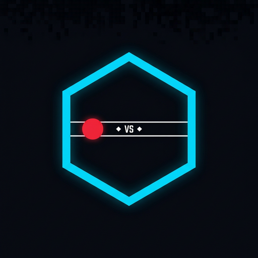
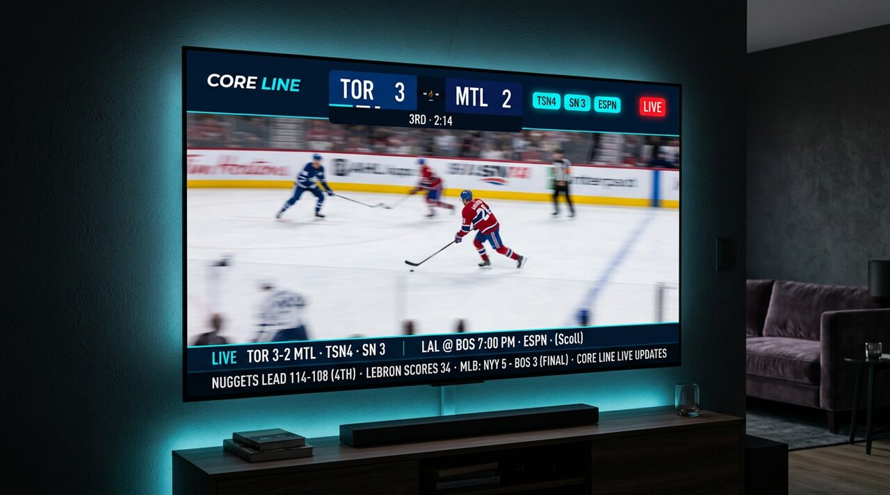

# Core Line

The sports and channel ticker Android TV never got.

```
LIVE  TOR 3-2 MTL  ·  TSN4  SN 3     ◆     LAL vs BOS  7:00 PM  ·  ESPN
```

Kodi had a crawl. A handful of apps still *publish* the slate as RSS. Nobody shipped the reader — a 10-foot, always-on chyron that just says **team vs team, then the channels**.

Core Line is that reader. It does not play video. It does not ship streams. It reads public scoreboards and whatever RSS / Atom / JSON you paste, and it crawls the line.

<p align="center">
  
</p>

<p align="center">
  
</p>

## Why it exists

A supporter put it plainly:

> An RSS Android/TV ticker for sports and channels. The RSS part should be easy because we have about 3 good apps that give channels but no reader to implement anymore outside of Kodi. Simply scrolling ticker… **Team vs team epn, tsn4, sn 3**.

That messy line is a first-class test. `epn` becomes ESPN. `tsn4` becomes TSN4. `sn 3` becomes SN 3.

## Android app

A native APK lives in [`android/`](android/) — phone, Shield, Google TV, Fire TV. One build, two launchers.

```
ticker/android   →  open in Android Studio  →  Build APK
```

The shell is a fullscreen WebView with a D-pad, keep-awake, and an on-device proxy so scoreboards and RSS work without a PC. On a TV, **Add from phone** shows a same-Wi-Fi QR so you never type a URL with the remote. Sideload `app-debug.apk` from the Actions artifact (or Android Studio). Full steps: [`android/README.md`](android/README.md).

## Run it on the web

```bash
cd ticker
node server.mjs
```

Open `http://0.0.0.0:8787` — or the phone / Shield / Fire TV on the same network.

| Surface | How |
|---|---|
| **Android / TV app** | Open `ticker/android` in Android Studio → Build APK → sideload |
| Phone / tablet browser | Chrome → Add to Home screen. Fullscreen PWA. |
| Desktop | Any modern browser. `F` fullscreen, `T` chyron-only, `S` settings. |

Web server: no npm install. Node 20+. Zero dependencies.

## Feeds

Settings → paste an RSS, Atom, or JSON URL from whatever already lists your channels.

Understood out of the box:

```
Maple Leafs vs Canadiens — TSN4, SN 3
LIVE Chiefs vs Bills | CBS / NFL Network
NHL: TOR vs MTL - TSN4 / SN Ontario
{"title":"Inter Miami vs LAFC","channels":["Apple TV+","TSN1"]}
```

A bundled sample feed ships so the crawl is never empty on first launch. Turn it off once you have your own.

Built-in scoreboards (when the network can reach them): NFL, NBA, MLB, NHL, NCAAF, NCAAB, WNBA, EPL, MLS, UCL, UFC, F1. If those APIs are blocked, Core Line falls back to a labeled demo slate so you can still judge the product.

## Remote

| Key | Action |
|---|---|
| D-pad / arrows | Move |
| OK / Enter | Select |
| `S` | Settings |
| `T` | Ticker-only clock |
| `R` | Refresh |
| `F` | Fullscreen |

Keep-screen-awake uses the Wake Lock API when the browser allows it.

## What this is not

A player. A playlist. A source of streams. Core Line is a TV *guide* chyron. You bring the listings; it reads them.

## Tests

```bash
cd ticker && npm test
```

Parser coverage includes the original supporter line.

## Part of Core Builds

Built for the same living-room crowd as the rest of [Core Builds](https://github.com/brevityA/Core-Builds). Branding, midnight theme, and the “it should just work on a TV” bar match the configurator.

This copy lives as a standalone app in the [Core Builds Apps](https://github.com/brevityA/CoreBuildsApps) repo (`ticker/`). It does not depend on anything else in that repo at runtime.
